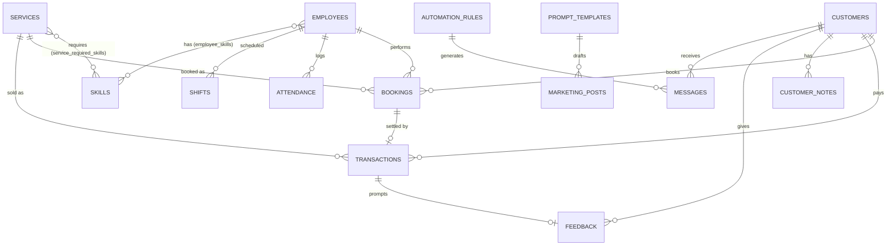

<USER_REQUEST>
/multi-agent-task-orchestrator /goal # Spa & Salon Management Platform — Supabase Backend Specification

**Document type:** Engineering specification, intended to be pasted directly into an AI coding agent (Claude Code, Cursor, etc.) as its primary instructions.
**Target stack:** Supabase (Postgres + Auth + Storage + Edge Functions + Realtime + `pg_cron` + `pg_net` + Vault).
**Source materials this spec was derived from:** (1) a UI/UX spec for an Admin/Reception desktop app and a Therapist mobile app, (2) an original technical spec written around a Python/FastAPI + Celery/Redis backend.
**Why the stack changed:** the original tech spec assumed a custom Python backend. This spec replaces that custom backend with Supabase: tables are exposed automatically over REST (PostgREST), business logic lives in Postgres functions ("pure SQL"), scheduling lives in `pg_cron`, and only the handful of operations that truly require an external HTTP call (Zalo, Facebook, Gemini, Google Sheets) become Edge Functions. Everything else is schema + SQL.

---

## 0. How To Use This Document (read this first, Agent)

You are implementing the backend for a Vietnamese spa/salon SME management platform on Supabase. This document is your spec. Read it fully before writing anything. It is organized as:

1. **§1 Architecture Overview** — how the pieces fit together.
2. **§2 Design Decisions & Assumptions** — places where the source requirements were ambiguous, incomplete, or contradictory, and the judgment calls made to resolve them. **Read this before touching the schema** — it explains *why* the schema looks the way it does, and flags decisions the business owner should sanity-check.
3. **§3 Database Schema** — the complete, literal SQL you must run, as Supabase migrations, in the order given. This is not a suggestion; table names, column names, and constraint logic here are the source of truth.
4. **§4 API & Dataflow Specification** — for every screen/feature in the source UI spec, what data operation it triggers, how it maps to Supabase (direct table REST call vs. RPC vs. Edge Function), and the step-by-step logic. This section intentionally does **not** hand you finished endpoint code — you write the actual queries/handlers — but the dataflow, inputs, outputs, and edge cases are fully specified so there is no ambiguity about *what* to build.
5. **§5 Rules & Constraints** — non-negotiable engineering rules (security, conventions, error handling). Treat these as acceptance criteria, not suggestions.
6. **§6 Migration File Plan** — exactly which files to create and in what order.
7. **§7 Acceptance Checklist** — self-verify against this before declaring the work done.
8. **§8 Appendix** — every secret/environment variable you will need, and where it's used.

**Ground rules while you work:**
- Do not invent tables, columns, or endpoints that aren't in this spec without flagging it in your output as an addition.
- Where this spec says a value is an assumption (marked **[ASSUMPTION]**), implement it as specified, but leave a short code comment so the business owner can change it easily.
- Prefer the SQL/RPC path over writing a custom server. Only reach for an Edge Function when §4.9 says to.
- All monetary amounts are Vietnamese Dong (VND) — integers, no decimal places.
- All Vietnamese text in templates/prompts stays in Vietnamese (customers and staff are Vietnamese-speaking); this spec document itself is in English so it's easy for you, the agent, to parse.

---

## 1. Architecture Overview

```
┌─────────────────────────────┐        ┌──────────────────────────────┐
│  Admin / Reception Web App   │        │   Therapist Mobile Web App    │
│  (desktop-first)              │        │   (mobile-first)               │
└──────────────┬───────────────┘        └───────────────┬───────────────┘
               │  supabase-js client (PostgREST + RPC + Realtime)          │
               └───────────────┬─────────────────────────┬────────────────┘
                                ▼                         ▼
                     ┌─────────────────────────────────────────┐
                     │              Supabase Project              │
                     │  ┌───────────────────────────────────┐  │
                     │  │ Postgres (source of truth)          │  │
                     │  │  - Tables + RLS (this doc, §3)      │  │
                     │  │  - Business-logic functions (§3.6)  │  │
                     │  │  - Views for dashboards (§3.7)      │  │
                     │  │  - pg_cron jobs (§3.8)               │  │
                     │  │  - pg_net (calls Edge Functions)     │  │
                     │  │  - Vault (secrets used by SQL)       │  │
                     │  └───────────────────────────────────┘  │
                     │  ┌───────────────────────────────────┐  │
                     │  │ Auth (auth.users)                   │  │
                     │  │  - 1 row per staff member            │  │
                     │  │  - employees.id = auth.users.id      │  │
                     │  └───────────────────────────────────┘  │
                     │  ┌───────────────────────────────────┐  │
                     │  │ Storage                             │  │
                     │  │  - avatars, spa logo, post images    │  │
                     │  └───────────────────────────────────┘  │
                     │  ┌───────────────────────────────────┐  │
                     │  │ Edge Functions (Deno) — §4.9         │  │
                     │  │  - zalo-webhook                      │  │
                     │  │  - dispatch-messages                 │  │
                     │  │  - publish-marketing-post            │  │
                     │  │  - generate-marketing-content         │  │
                     │  │  - attendance-webhook                │  │
                     │  │  - export-google-sheets              │  │
                     │  │  - admin-create-employee             │  │
                     │  └───────────────────────────────────┘  │
                     └────────────────┬────────────────────────┘
                                       │ HTTPS (via pg_net + Edge Functions)
                     ┌─────────────────┴──────────────────────────┐
                     ▼                 ▼                          ▼
              Zalo OA API      Facebook Graph API         Gemini API, Google Sheets API,
                                                            fingerprint/FaceID device webhook
```

**Core principle — where does logic live?**
| Kind of logic | Where it lives |
|---|---|
| CRUD on a single table (list customers, create a service, update a shift) | Direct PostgREST call from the frontend (`supabase.from('table')...`), protected by RLS. No custom endpoint needed. |
| Cross-table business logic that's pure computation (booking-conflict check, tiering, template rendering) | A Postgres function (SQL/PLpgSQL), called via `supabase.rpc(...)` or fired automatically by a trigger. |
| Anything on a timer (cron, birthday scan, nightly batch) | `pg_cron` calling a Postgres function directly. |
| Anything that must call an external HTTP API with a secret (Zalo, Facebook, Gemini, Google Sheets, a fingerprint device webhook) | A Supabase Edge Function. `pg_cron` + `pg_net` trigger it on schedule where relevant; Postgres never holds a raw third-party API key — only Vault does, and only the Edge Function or a tightly scoped SQL function may read it. |

This is what "pure SQL for the API" means in practice: **table access and business rules are 100% SQL/Postgres**; a thin, minimal layer of Edge Functions exists *only* where an external network call with secrets is unavoidable.

---

## 2. Design Decisions & Assumptions

The two source documents (UI spec + original tech spec) leave some gaps or contradictions. Rather than silently guessing, every non-obvious call made while designing the schema is listed here. **The business owner should skim this section before implementation begins** — anything below can be changed with a small schema edit if it doesn't match reality.

1. **Roles.** The UI spec only shows two app surfaces ("Admin/Reception" and "Therapist"), but a real spa usually wants owner-level data (revenue, HR) hidden from front-desk staff. This spec adds a 3-way `employee_role`: `admin` (owner/manager, full access), `receptionist` (bookings/CRM/checkout, no settings or payroll), `therapist` (own schedule only). If the business genuinely wants only 2 tiers, collapse `receptionist` into `admin` in §3.2 and simplify the RLS policies in §3.5.
2. **Skills as a normalized table, not a JSON array.** The original spec stored `Employee.skills` as a raw JSON array. This spec normalizes skills into a `skills` lookup table plus `employee_skills` / `service_required_skills` join tables. Reasoning: the booking-matching algorithm (the single most important piece of logic in Module 1) needs to reliably join "what a service requires" against "what an employee has" — free-text JSON arrays invite typos (`'facial'` vs `'Facial'`) that silently break matching. A lookup table is enforced by foreign key, is easy for an admin to manage, and is trivially indexable.
3. **Services and Bookings tables added.** Neither is explicitly modeled in the original tech spec's data model, but both are required by the UI spec (Services grid, Calendar/Booking screen) and are the connective tissue between HR, CRM, and Analytics. They are added here as first-class tables.
4. **Booking status vocabulary.** The Therapist app shows "Đang chờ / Đang thực hiện / Đã xong" (Waiting / In Progress / Done); the Calendar screen implies bookings also get cancelled or no-show. This spec unifies both into one `booking_status` enum: `scheduled → in_progress → completed`, plus `cancelled` and `no_show`. "Waiting" in the Therapist UI is just any booking still in `scheduled` status for today — no separate DB state needed.
5. **Booking overlap prevention is enforced at the database level**, not just in application code, via a Postgres `EXCLUDE` constraint (§3.3, `bookings` table). This guarantees two bookings can never overlap for the same therapist even under concurrent writes — application-level checks alone can race.
6. **Customer tier priority when rules conflict.** The original spec gives four independent-sounding rules for `new/regular/vip/churned` that can overlap (e.g., a customer with 6 visits who hasn't returned in 65 days matches both "vip" and "churned"). This spec's `auto_segment_customers()` (§3.6) resolves conflicts in this priority order: **VIP > churned > regular > new**. Rationale: VIP status reflects lifetime value and is treated as "sticky" — a lapsed VIP is exactly who a win-back campcampaign should target *as a VIP*, which the automation-rule example in the source doc (`{tier: 'vip', days_inactive: 14}`) supports directly. If the business wants inactive VIPs relabeled `churned` instead, flip the order of the first two `WHEN` branches in that function.
7. **"Checkout event → 8:00 → delay 2h → send Zalo feedback request."** The literal text in the source doc is ambiguous about what "8:00" refers to (it reads like a formatting artifact, since this rule is listed under *event-driven*, not *time-driven*, triggers). This spec implements it as: **on transaction insert (checkout), enqueue a feedback-request message with a configurable delay (default 2 hours)** — i.e., the trigger is the checkout event itself, not a fixed clock time. The delay is stored in `automation_rules.conditions->>'delay_hours'` so it's adjustable without a code change. Flag this to the business owner to confirm.
8. **PII encryption scope.** The tech spec asks IT to encrypt customer PII, specifically calling out phone number and real name. This spec encrypts **phone number** at rest (via `pgcrypto`, with a deterministic hash column for exact-match lookup so search/dedup still works without decrypting) because phone numbers are the highest-risk PII here (spam/harassment vector, used for `dob`-adjacent identity theft) and are rarely displayed in full in the UI. **Full name is kept as plain text**, gated behind RLS only — encrypting it would break every name-search and name-display surface in the UI spec (customer table, global search, booking cards) for a modest security gain, since staff already need broad name visibility to do their jobs. If the business insists on encrypting names too, the same `_encrypted` + `_hash` column pattern used for `phone` can be copied, at the cost of losing partial/fuzzy name search.
9. **Soft-delete over hard-delete for `services` and `employees`.** The UI spec shows both "Sửa/Xóa/Tạm ngưng" (Edit/Delete/Suspend) on services. Hard-deleting a service or employee that's referenced by historical bookings/transactions would corrupt reporting. All such foreign keys use `ON DELETE RESTRICT`; "Delete" in the UI should attempt a real `DELETE` and catch the FK-violation error to prompt "this service has history — suspend it instead" (see §4.5). `status = 'suspended'/'inactive'` is the real-world "delete."
10. **Fill-rate KPI formula.** "Tỷ lệ lấp đầy" (fill rate) is shown on the dashboard but never defined numerically in the source docs. This spec defines it as: `(sum of booked-minutes today across all active therapists) / (active therapist count × spa's daily open-to-close minutes) × 100`. This is a judgment call — confirm it matches the business's intended meaning (it could alternatively mean "% of pre-defined bookable slots filled," which would require modeling slots explicitly; this spec does not model discrete slots since the calendar UI is continuous/free-form).
11. **`messages` table serves as both the outbound queue and the historical log** (an "outbox" pattern) rather than two separate tables — a message row is inserted once with `status='pending'` and updated in place as it moves through `processing → sent/failed`. This keeps the queueing logic and the CRM communication history in one place and avoids duplicate-write bugs.
12. **`prompt_templates` centralizes every LLM system prompt**, including the Module 3 content-generation prompts (sale/knowledge/greeting) *and* the Module 2 feedback-sentiment-analysis prompt. The original spec treats these as separate concerns; this spec unifies them so non-engineers can tune wording from the admin UI without a redeploy.
13. **Every employee is a Supabase Auth user.** Both admin/reception (desktop) and therapists (mobile) log in, so `employees.id` is a foreign key directly to `auth.users.id` rather than a separate `profiles` table. Customers do **not** get Supabase Auth accounts — there's no customer-facing portal in the source spec, only outbound Zalo/Facebook messaging.

---

## 3. Database Schema

Run everything in this section as Supabase SQL migrations, **in the order presented** (later objects depend on earlier ones). See §6 for how to split this into migration files.

### 3.1 Extensions

```sql
-- Core
create extension if not exists pgcrypto;      -- gen_random_uuid(), PII encryption
create extension if not exists pg_trgm;       -- fuzzy/ILIKE search (global search, customer name)
create extension if not exists btree_gist;    -- required for the EXCLUDE constraint on bookings

-- Automation (may also need enabling via Dashboard → Database → Extensions
-- on some Supabase projects; the SQL form below works in current projects)
create extension if not exists pg_net;        -- async HTTP calls from SQL -> Edge Functions
create extension if not exists pg_cron;       -- scheduled jobs (all schedules are UTC, see §3.8)

-- Secrets used by SQL functions (net.http_post headers, etc.)
create extension if not exists supabase_vault;
```

> **Note for the agent:** `pg_net` and `pg_cron` occasionally require enabling once via the Supabase Dashboard (Database → Extensions) on top of the `CREATE EXTENSION` statement, depending on project settings. If the migration fails on these two lines specifically, enable them from the Dashboard and re-run.

### 3.2 Enum Types

```sql
create type employee_role as enum ('admin', 'receptionist', 'therapist');
create type employee_status as enum ('active', 'inactive');
create type attendance_status as enum ('on_time', 'late', 'absent');
create type attendance_source as enum ('app', 'device', 'manual');
create type shift_type as enum ('morning', 'afternoon', 'evening');
create type shift_status as enum ('scheduled', 'cancelled');
create type service_status as enum ('active', 'inactive', 'suspended');
create type customer_tier as enum ('new', 'regular', 'vip', 'churned');
create type note_type as enum ('preference', 'health_warning', 'general');
create type booking_status as enum ('scheduled', 'in_progress', 'completed', 'cancelled', 'no_show');
create type payment_method as enum ('cash', 'card', 'bank_transfer', 'e_wallet', 'other');
create type feedback_intent as enum ('praise', 'complaint', 'neutral');
create type automation_trigger_type as enum ('time_based', 'event_based');
create type message_channel as enum ('zalo', 'facebook', 'telegram', 'sms');
create type message_type as enum (
  'birthday_greeting', 'appointment_reminder', 'feedback_request',
  'feedback_reply', 'low_rating_alert', 'marketing_broadcast', 'other'
);
create type message_direction as enum ('outbound', 'inbound');
create type message_status as enum ('pending', 'processing', 'sent', 'delivered', 'read', 'failed', 'cancelled');
create type marketing_channel as enum ('zalo', 'facebook');
create type marketing_post_status as enum ('draft', 'pending', 'processing', 'posted', 'failed');
create type prompt_category as enum ('sale', 'knowledge', 'greeting', 'feedback_analysis', 'other');
create type notification_type as enum (
  'new_booking', 'booking_cancelled', 'low_rating_alert',
  'birthday_today', 'shift_published', 'system', 'other'
);
```

### 3.3 Tables

Generic trigger used by almost every table below:

```sql
create or replace function set_updated_at() returns trigger
language plpgsql as $$
begin
  new.updated_at = now();
  return new;
end;
$$;
```

#### 3.3.1 `spa_settings` (singleton — always exactly one row)

```sql
create table spa_settings (
  id boolean primary key default true,
  spa_name text not null,
  address text,
  email text,
  phone text,
  open_time time not null default '09:00',
  close_time time not null default '20:00',
  timezone text not null default 'Asia/Ho_Chi_Minh',
  logo_url text,
  auto_repeat_shifts boolean not null default false,
  updated_at timestamptz not null default now(),
  constraint spa_settings_singleton check (id) -- only TRUE is a legal PK value => max 1 row ever
);

create trigger trg_spa_settings_updated_at
  before update on spa_settings for each row execute function set_updated_at();

-- seed the single row so the app never has to handle "no settings yet"
insert into spa_settings (id, spa_name) values (true, 'My Spa') on conflict (id) do nothing;
```

#### 3.3.2 `employees`

`employees.id` **is** `auth.users.id` — every employee is a login. See §4.4 for why creation goes through an Edge Function rather than a trigger on `auth.users`.

```sql
create table employees (
  id uuid primary key references auth.users(id) on delete cascade,
  full_name text not null,
  phone text not null,
  role employee_role not null default 'therapist',
  status employee_status not null default 'active',
  avatar_url text,
  external_device_code text unique, -- maps fingerprint/FaceID device IDs to this employee
  hired_at date not null default current_date,
  created_at timestamptz not null default now(),
  updated_at timestamptz not null default now(),
  constraint employees_phone_format check (phone ~ '^[0-9+][0-9 ]{7,14}$'),
  constraint employees_full_name_not_blank check (btrim(full_name) <> '')
);

create unique index employees_phone_key on employees (phone);
create index employees_role_status_idx on employees (role, status);
create index employees_full_name_trgm on employees using gin (full_name gin_trgm_ops);

create trigger trg_employees_updated_at
  before update on employees for each row execute function set_updated_at();
```

#### 3.3.3 `skills`

```sql
create table skills (
  id uuid primary key default gen_random_uuid(),
  code text not null unique,   -- machine key, e.g. massage_body, facial, nail
  name_vi text not null,
  name_en text,
  is_active boolean not null default true,
  created_at timestamptz not null default now(),
  constraint skills_code_format check (code ~ '^[a-z0-9_]+$')
);
```

#### 3.3.4 `employee_skills` (junction)

```sql
create table employee_skills (
  employee_id uuid not null references employees(id) on delete cascade,
  skill_id uuid not null references skills(id) on delete restrict,
  created_at timestamptz not null default now(),
  primary key (employee_id, skill_id)
);

create index employee_skills_skill_idx on employee_skills (skill_id);
```

#### 3.3.5 `attendance`

```sql
create table attendance (
  id uuid primary key default gen_random_uuid(),
  employee_id uuid not null references employees(id) on delete cascade,
  check_in_time timestamptz,
  check_out_time timestamptz,
  status attendance_status not null default 'on_time',
  source attendance_source not null default 'app',
  created_at timestamptz not null default now(),
  constraint attendance_checkout_after_checkin
    check (check_out_time is null or check_in_time is null or check_out_time > check_in_time)
);

create index attendance_employee_time_idx on attendance (employee_id, check_in_time desc);
```

#### 3.3.6 `shifts`

```sql
create table shifts (
  id uuid primary key default gen_random_uuid(),
  employee_id uuid not null references employees(id) on delete cascade,
  shift_date date not null,
  shift_type shift_type not null,
  status shift_status not null default 'scheduled',
  created_at timestamptz not null default now(),
  updated_at timestamptz not null default now(),
  unique (employee_id, shift_date, shift_type)
);

create index shifts_date_idx on shifts (shift_date);
create index shifts_employee_date_idx on shifts (employee_id, shift_date);

create trigger trg_shifts_updated_at
  before update on shifts for each row execute function set_updated_at();
```

#### 3.3.7 `services`

```sql
create table services (
  id uuid primary key default gen_random_uuid(),
  name text not null,
  description text,
  price numeric(12,0) not null check (price >= 0),               -- VND, whole numbers only
  duration_minutes integer not null check (duration_minutes > 0 and duration_minutes <= 480),
  status service_status not null default 'active',
  created_at timestamptz not null default now(),
  updated_at timestamptz not null default now(),
  constraint services_name_not_blank check (btrim(name) <> '')
);

create index services_status_idx on services (status);

create trigger trg_services_updated_at
  before update on services for each row execute function set_updated_at();
```

#### 3.3.8 `service_required_skills` (junction)

```sql
create table service_required_skills (
  service_id uuid not null references services(id) on delete cascade,
  skill_id uuid not null references skills(id) on delete restrict,
  primary key (service_id, skill_id)
);
```

#### 3.3.9 `customers`

Phone is stored encrypted (`pgcrypto`) with a deterministic hash for lookups — see §2 decision 8 and §3.6 for the helper functions that read/write `phone_encrypted`.

```sql
create table customers (
  id uuid primary key default gen_random_uuid(),
  full_name text not null,
  phone_encrypted bytea not null,   -- pgp_sym_encrypt(phone, key) — never store plaintext phone
  phone_hash text not null,         -- sha256(normalized phone) — used for exact-match search/uniqueness
  phone_last4 text not null,        -- last 4 digits, safe to display without decrypting
  dob date,
  zalo_user_id text unique,
  tier customer_tier not null default 'new',
  total_spent numeric(14,0) not null default 0,   -- denormalized, kept in sync by trigger (§3.6)
  visit_count integer not null default 0,          -- denormalized, kept in sync by trigger (§3.6)
  last_visit_at timestamptz,
  preferences jsonb not null default '{}'::jsonb,  -- e.g. {"likes": ["massage_chan"], "notes": "..."}
  created_at timestamptz not null default now(),
  updated_at timestamptz not null default now(),
  constraint customers_total_spent_nonneg check (total_spent >= 0),
  constraint customers_visit_count_nonneg check (visit_count >= 0),
  constraint customers_full_name_not_blank check (btrim(full_name) <> '')
);

create unique index customers_phone_hash_key on customers (phone_hash);
create index customers_tier_idx on customers (tier);
create index customers_preferences_gin on customers using gin (preferences);
create index customers_full_name_trgm on customers using gin (full_name gin_trgm_ops);

create trigger trg_customers_updated_at
  before update on customers for each row execute function set_updated_at();
```

#### 3.3.10 `customer_notes` (drives the Therapist app's red/orange "Care Notes")

```sql
create table customer_notes (
  id uuid primary key default gen_random_uuid(),
  customer_id uuid not null references customers(id) on delete cascade,
  note_type note_type not null default 'general',
  content text not null,
  created_by uuid references employees(id) on delete set null,
  created_at timestamptz not null default now(),
  constraint customer_notes_content_not_blank check (btrim(content) <> '')
);

create index customer_notes_customer_idx on customer_notes (customer_id);
create index customer_notes_type_idx on customer_notes (note_type);
```

#### 3.3.11 `bookings`

The `exclude` constraint is what makes double-booking a therapist **impossible**, even under concurrent requests — this is enforced by Postgres itself, not application code.

```sql
create table bookings (
  id uuid primary key default gen_random_uuid(),
  customer_id uuid not null references customers(id) on delete restrict,
  employee_id uuid not null references employees(id) on delete restrict,
  service_id uuid not null references services(id) on delete restrict,
  start_time timestamptz not null,
  end_time timestamptz not null,
  status booking_status not null default 'scheduled',
  notes text,
  created_by uuid references employees(id) on delete set null,
  created_at timestamptz not null default now(),
  updated_at timestamptz not null default now(),
  constraint bookings_time_valid check (end_time > start_time),
  exclude using gist (
    employee_id with =,
    tstzrange(start_time, end_time, '[)') with &&
  ) where (status not in ('cancelled', 'no_show'))
);

create index bookings_customer_idx on bookings (customer_id);
create index bookings_start_time_idx on bookings (start_time);
create index bookings_employee_date_idx on bookings (employee_id, start_time);
create index bookings_status_idx on bookings (status);

create trigger trg_bookings_updated_at
  before update on bookings for each row execute function set_updated_at();
```

#### 3.3.12 `transactions` (created at Checkout)

```sql
create table transactions (
  id uuid primary key default gen_random_uuid(),
  booking_id uuid references bookings(id) on delete set null,   -- nullable: walk-ins without a prior booking
  customer_id uuid not null references customers(id) on delete restrict,
  employee_id uuid not null references employees(id) on delete restrict,
  service_id uuid not null references services(id) on delete restrict,
  amount numeric(14,0) not null check (amount >= 0),
  discount_amount numeric(14,0) not null default 0 check (discount_amount >= 0),
  final_amount numeric(14,0) generated always as (amount - discount_amount) stored,
  payment_method payment_method not null default 'cash',
  staff_note text,
  feedback_score smallint check (feedback_score between 1 and 5),  -- denormalized copy, synced from feedback (§3.6)
  transacted_at timestamptz not null default now(),
  created_at timestamptz not null default now(),
  constraint transactions_discount_not_over_amount check (discount_amount <= amount)
);

create index transactions_customer_idx on transactions (customer_id);
create index transactions_employee_idx on transactions (employee_id);
create index transactions_transacted_at_idx on transactions (transacted_at);
```

#### 3.3.13 `prompt_templates` (centralized LLM prompts — see §2 decision 12)

```sql
create table prompt_templates (
  id uuid primary key default gen_random_uuid(),
  name text not null unique,
  category prompt_category not null,
  prompt_text text not null,
  is_active boolean not null default true,
  created_at timestamptz not null default now(),
  updated_at timestamptz not null default now(),
  constraint prompt_templates_text_not_blank check (btrim(prompt_text) <> '')
);

create trigger trg_prompt_templates_updated_at
  before update on prompt_templates for each row execute function set_updated_at();
```

#### 3.3.14 `automation_rules`

```sql
create table automation_rules (
  id uuid primary key default gen_random_uuid(),
  name text not null unique,                 -- business key, used by functions in §3.6 to look rules up
  trigger_type automation_trigger_type not null,
  event_name text,                            -- required + meaningful when trigger_type = 'event_based'
  cron_schedule text,                         -- descriptive only when trigger_type = 'time_based'; actual schedule lives in pg_cron (§3.8)
  conditions jsonb not null default '{}'::jsonb,  -- e.g. {"tier": "vip", "days_inactive": 14, "delay_hours": 2}
  channel message_channel not null default 'zalo',
  template_msg text not null,                 -- may contain {ten_khach}, {ngay}, {gio}, {dich_vu} placeholders
  is_active boolean not null default true,
  created_at timestamptz not null default now(),
  updated_at timestamptz not null default now(),
  constraint automation_rules_event_or_cron check (
    (trigger_type = 'event_based' and event_name is not null and btrim(event_name) <> '') or
    (trigger_type = 'time_based' and cron_schedule is not null and btrim(cron_schedule) <> '')
  ),
  constraint automation_rules_template_not_blank check (btrim(template_msg) <> '')
);

create index automation_rules_active_idx on automation_rules (is_active);

create trigger trg_automation_rules_updated_at
  before update on automation_rules for each row execute function set_updated_at();
```

#### 3.3.15 `messages` (unified outbound queue + inbound/outbound historical log — see §2 decision 11)

```sql
create table messages (
  id uuid primary key default gen_random_uuid(),
  customer_id uuid references customers(id) on delete set null,
  automation_rule_id uuid references automation_rules(id) on delete set null,
  channel message_channel not null,
  direction message_direction not null default 'outbound',
  message_type message_type not null,
  content text not null,
  external_message_id text,          -- Zalo/Facebook/Telegram message ID once sent
  status message_status not null default 'pending',
  send_after timestamptz not null default now(),  -- queue: don't dispatch before this time
  sent_at timestamptz,
  retry_count integer not null default 0,
  last_error text,
  created_at timestamptz not null default now()
);

create index messages_pending_idx on messages (status, send_after) where status = 'pending';
create index messages_customer_idx on messages (customer_id);
create index messages_type_idx on messages (message_type);
```

#### 3.3.16 `feedback`

```sql
create table feedback (
  id uuid primary key default gen_random_uuid(),
  customer_id uuid not null references customers(id) on delete cascade,
  transaction_id uuid references transactions(id) on delete set null,
  message_id uuid references messages(id) on delete set null,  -- the inbound reply this was parsed from, if any
  rating smallint not null check (rating between 1 and 5),
  intent feedback_intent not null default 'neutral',
  key_point text,
  raw_text text not null,
  created_at timestamptz not null default now()
);

create index feedback_customer_idx on feedback (customer_id);
create index feedback_transaction_idx on feedback (transaction_id);
create index feedback_low_rating_idx on feedback (rating) where rating <= 3;
```

#### 3.3.17 `marketing_posts`

```sql
create table marketing_posts (
  id uuid primary key default gen_random_uuid(),
  content text not null,
  image_urls text[] not null default '{}',
  channels marketing_channel[] not null,
  keyword text,                             -- the keyword the owner typed in to generate this post
  prompt_template_id uuid references prompt_templates(id) on delete set null,
  ai_variations jsonb,                      -- the (up to 3) AI-generated options shown before one was picked
  scheduled_time timestamptz not null,
  status marketing_post_status not null default 'draft',
  retry_count integer not null default 0,
  last_error text,
  external_post_ids jsonb,                  -- {"facebook": "...", "zalo": "..."} once posted
  created_by uuid references employees(id) on delete set null,
  created_at timestamptz not null default now(),
  updated_at timestamptz not null default now(),
  constraint marketing_posts_channels_nonempty check (array_length(channels, 1) > 0),
  constraint marketing_posts_content_not_blank check (btrim(content) <> '')
);

create index marketing_posts_pending_idx on marketing_posts (status, scheduled_time) where status = 'pending';

create trigger trg_marketing_posts_updated_at
  before update on marketing_posts for each row execute function set_updated_at();
```

#### 3.3.18 `notifications` (admin bell icon)

```sql
create table notifications (
  id uuid primary key default gen_random_uuid(),
  recipient_id uuid references employees(id) on delete cascade,   -- targeted to one employee
  recipient_role employee_role,                                    -- OR broadcast to a whole role
  type notification_type not null,
  title text not null,
  body text,
  related_entity_type text,
  related_entity_id uuid,
  is_read boolean not null default false,
  created_at timestamptz not null default now(),
  constraint notifications_target_check check (recipient_id is not null or recipient_role is not null)
);

create index notifications_recipient_idx on notifications (recipient_id, is_read);
create index notifications_role_idx on notifications (recipient_role, is_read);
```

### 3.4 Role Helper Function

Every RLS policy below is built on one helper, so permission logic lives in exactly one place:

```sql
create or replace function current_employee_role() returns employee_role
language sql stable security definer set search_path = public as $$
  select role from employees where id = auth.uid() and status = 'active';
$$;

comment on function current_employee_role() is
  'Returns the role of the currently authenticated employee, or NULL if unauthenticated / not an active employee. NULL fails every role check below by default (secure-by-default).';
```

### 3.5 Row-Level Security

> **Baseline note:** Supabase grants baseline table privileges (`SELECT/INSERT/UPDATE/DELETE`) to the `authenticated` role by default when a table is created in `public`; RLS is what actually restricts *which rows*. If your project happens not to have those default grants, run once:
> `grant select, insert, update, delete on all tables in schema public to authenticated;`
> then rely on the policies below as the real access-control layer. **Every single table in §3.3 must have RLS enabled — this is not optional, see §5.1.**

```sql
alter table spa_settings enable row level security;
alter table employees enable row level security;
alter table skills enable row level security;
alter table employee_skills enable row level security;
alter table attendance enable row level security;
alter table shifts enable row level security;
alter table services enable row level security;
alter table service_required_skills enable row level security;
alter table customers enable row level security;
alter table customer_notes enable row level security;
alter table bookings enable row level security;
alter table transactions enable row level security;
alter table prompt_templates enable row level security;
alter table automation_rules enable row level security;
alter table messages enable row level security;
alter table feedback enable row level security;
alter table marketing_posts enable row level security;
alter table notifications enable row level security;
```

#### `spa_settings` — everyone reads, only admin writes

```sql
create policy spa_settings_select on spa_settings for select
  using (current_employee_role() is not null);

create policy spa_settings_update on spa_settings for update
  using (current_employee_role() = 'admin');
-- no insert/delete policy: the singleton row is seeded once by migration (§3.3.1) and never re-created/removed.
```

#### `employees` — admin/reception see all, therapist sees self only; writes are admin-only (creation is service-role only, see §4.4)

```sql
create policy employees_select_admin_reception on employees for select
  using (current_employee_role() in ('admin', 'receptionist'));

create policy employees_select_self on employees for select
  using (id = auth.uid());

create policy employees_update_admin on employees for update
  using (current_employee_role() = 'admin');

create policy employees_update_self_limited on employees for update
  using (id = auth.uid())
  with check (id = auth.uid());
-- NOTE: this self-update policy is row-level only; restrict which columns a therapist may
-- self-edit (e.g. avatar_url) at the application layer or with a dedicated RPC — do not let
-- the frontend send a raw PATCH with `role` in the body for a self-update.
-- No insert policy on purpose: rows are created only by the admin-create-employee Edge Function (service role).
```

#### `skills` / `employee_skills` / `service_required_skills` — read for all staff, write for admin only

```sql
create policy skills_select_all on skills for select using (current_employee_role() is not null);
create policy skills_write_admin on skills for insert with check (current_employee_role() = 'admin');
create policy skills_update_admin on skills for update using (current_employee_role() = 'admin');
create policy skills_delete_admin on skills for delete using (current_employee_role() = 'admin');

create policy employee_skills_select_all on employee_skills for select using (current_employee_role() is not null);
create policy employee_skills_write_admin on employee_skills for insert with check (current_employee_role() = 'admin');
create policy employee_skills_delete_admin on employee_skills for delete using (current_employee_role() = 'admin');

create policy service_required_skills_select_all on service_required_skills for select using (current_employee_role() is not null);
create policy service_required_skills_write_admin on service_required_skills for insert with check (current_employee_role() = 'admin');
create policy service_required_skills_delete_admin on service_required_skills for delete using (current_employee_role() = 'admin');
```

#### `attendance` — admin/reception see all; therapist sees + checks self in/out

```sql
create policy attendance_select_admin_reception on attendance for select
  using (current_employee_role() in ('admin', 'receptionist'));

create policy attendance_select_self on attendance for select
  using (employee_id = auth.uid());

create policy attendance_insert_self on attendance for insert
  with check (employee_id = auth.uid() and source = 'app');

create policy attendance_write_admin on attendance for update
  using (current_employee_role() = 'admin');

create policy attendance_delete_admin on attendance for delete
  using (current_employee_role() = 'admin');
-- Device (fingerprint/FaceID) and manual attendance rows are written by the
-- attendance-webhook Edge Function using the service role, which bypasses RLS entirely.
```

#### `shifts` — admin manages, reception reads, therapist reads own

```sql
create policy shifts_select_admin_reception on shifts for select
  using (current_employee_role() in ('admin', 'receptionist'));

create policy shifts_select_self on shifts for select
  using (employee_id = auth.uid());

create policy shifts_write_admin on shifts for insert with check (current_employee_role() = 'admin');
create policy shifts_update_admin on shifts for update using (current_employee_role() = 'admin');
create policy shifts_delete_admin on shifts for delete using (current_employee_role() = 'admin');
```

#### `services` — everyone reads active services; admin manages

```sql
create policy services_select_active_all on services for select
  using (current_employee_role() is not null and status = 'active');

create policy services_select_all_admin on services for select
  using (current_employee_role() = 'admin');

create policy services_write_admin on services for insert with check (current_employee_role() = 'admin');
create policy services_update_admin on services for update using (current_employee_role() = 'admin');
create policy services_delete_admin on services for delete using (current_employee_role() = 'admin');
```

#### `customers` / `customer_notes` — admin/reception full access; therapist limited to today's/own customers

```sql
create policy customers_select_admin_reception on customers for select
  using (current_employee_role() in ('admin', 'receptionist'));

create policy customers_select_therapist_own on customers for select
  using (
    current_employee_role() = 'therapist'
    and exists (
      select 1 from bookings b
      where b.customer_id = customers.id and b.employee_id = auth.uid()
    )
  );

create policy customers_write_admin_reception on customers for insert
  with check (current_employee_role() in ('admin', 'receptionist'));

create policy customers_update_admin_reception on customers for update
  using (current_employee_role() in ('admin', 'receptionist'));

create policy customers_delete_admin on customers for delete
  using (current_employee_role() = 'admin');

create policy customer_notes_select_admin_reception on customer_notes for select
  using (current_employee_role() in ('admin', 'receptionist'));

create policy customer_notes_select_therapist_own on customer_notes for select
  using (
    current_employee_role() = 'therapist'
    and exists (
      select 1 from bookings b
      where b.customer_id = customer_notes.customer_id and b.employee_id = auth.uid()
    )
  );

create policy customer_notes_insert_staff on customer_notes for insert
  with check (
    current_employee_role() in ('admin', 'receptionist')
    or (current_employee_role() = 'therapist' and exists (
      select 1 from bookings b
      where b.customer_id = customer_notes.customer_id and b.employee_id = auth.uid()
    ))
  );

create policy customer_notes_update_admin_reception on customer_notes for update
  using (current_employee_role() in ('admin', 'receptionist'));

create policy customer_notes_delete_admin on customer_notes for delete
  using (current_employee_role() = 'admin');
```

#### `bookings` — admin/reception full CRUD; therapist read-only on own bookings (status changes go through RPCs in §3.6, not raw UPDATE)

```sql
create policy bookings_select_admin_reception on bookings for select
  using (current_employee_role() in ('admin', 'receptionist'));

create policy bookings_select_self on bookings for select
  using (employee_id = auth.uid());

create policy bookings_write_admin_reception on bookings for insert
  with check (current_employee_role() in ('admin', 'receptionist'));

create policy bookings_update_admin_reception on bookings for update
  using (current_employee_role() in ('admin', 'receptionist'));

create policy bookings_delete_admin_reception on bookings for delete
  using (current_employee_role() in ('admin', 'receptionist'));
-- Deliberately no UPDATE policy for 'therapist': start/complete actions call
-- start_booking()/complete_booking() (§3.6), which are SECURITY DEFINER and verify
-- employee_id = auth.uid() internally. This prevents a therapist client from PATCHing
-- arbitrary booking fields while still allowing the two actions their UI actually needs.
```

#### `transactions` — admin/reception only; therapist has no access

```sql
create policy transactions_select_admin_reception on transactions for select
  using (current_employee_role() in ('admin', 'receptionist'));

create policy transactions_insert_admin_reception on transactions for insert
  with check (current_employee_role() in ('admin', 'receptionist'));

create policy transactions_update_admin on transactions for update
  using (current_employee_role() = 'admin');
-- No delete policy: transactions are financial records and must not be deletable from the client.
```

#### `prompt_templates` / `automation_rules` — admin manages; reception can read prompt templates only

```sql
create policy prompt_templates_select_admin on prompt_templates for select
  using (current_employee_role() = 'admin');

create policy prompt_templates_select_reception on prompt_templates for select
  using (current_employee_role() = 'receptionist' and category in ('sale', 'knowledge', 'greeting'));

create policy prompt_templates_write_admin on prompt_templates for insert with check (current_employee_role() = 'admin');
create policy prompt_templates_update_admin on prompt_templates for update using (current_employee_role() = 'admin');
create policy prompt_templates_delete_admin on prompt_templates for delete using (current_employee_role() = 'admin');

create policy automation_rules_select_admin on automation_rules for select using (current_employee_role() = 'admin');
create policy automation_rules_write_admin on automation_rules for insert with check (current_employee_role() = 'admin');
create policy automation_rules_update_admin on automation_rules for update using (current_employee_role() = 'admin');
create policy automation_rules_delete_admin on automation_rules for delete using (current_employee_role() = 'admin');
```

#### `messages` — read-only for admin/reception from the client; all writes happen via SQL functions or the service role

```sql
create policy messages_select_admin_reception on messages for select
  using (current_employee_role() in ('admin', 'receptionist'));
-- No client-side insert/update/delete policies at all. Rows are written exclusively by:
--   (a) SECURITY DEFINER trigger functions (enqueue_*, §3.6), or
--   (b) the dispatch-messages Edge Function using the service role (status updates after sending).
```

#### `feedback` — admin/reception read; no client writes (system-generated from the sentiment pipeline)

```sql
create policy feedback_select_admin_reception on feedback for select
  using (current_employee_role() in ('admin', 'receptionist'));
-- No client insert policy: feedback rows are written by the zalo-webhook Edge Function
-- (service role) after Gemini sentiment analysis, via the record_feedback() RPC (§3.6).
```

#### `marketing_posts` — admin full CRUD; reception read-only; therapist no access

```sql
create policy marketing_posts_select_admin on marketing_posts for select
  using (current_employee_role() = 'admin');

create policy marketing_posts_select_reception on marketing_posts for select
  using (current_employee_role() = 'receptionist');

create policy marketing_posts_write_admin on marketing_posts for insert with check (current_employee_role() = 'admin');
create policy marketing_posts_update_admin on marketing_posts for update using (current_employee_role() = 'admin');
create policy marketing_posts_delete_admin on marketing_posts for delete using (current_employee_role() = 'admin');
```

#### `notifications` — each employee sees their own + broadcasts to their role; can only mark their own as read

```sql
create policy notifications_select_own on notifications for select
  using (
    recipient_id = auth.uid()
    or recipient_role = current_employee_role()
  );

create policy notifications_update_own on notifications for update
  using (recipient_id = auth.uid() or recipient_role = current_employee_role())
  with check (recipient_id = auth.uid() or recipient_role = current_employee_role());
-- No client insert/delete: notifications are system-generated only (triggers in §3.6 / service role).
```

### 3.6 Functions & Triggers

This is the actual "business logic" layer. Every rule from the original tech spec's "System Logic" subsections is implemented here as SQL, not in application code.

#### 3.6.1 Secrets access (Vault)

All third-party keys and the PII encryption key live in Supabase Vault, never in a table or hardcoded string. See §8 for the full list of secrets to create.

```sql
create or replace function get_secret(p_name text) returns text
language sql stable security definer set search_path = public, vault as $$
  select decrypted_secret from vault.decrypted_secrets where name = p_name limit 1;
$$;

revoke execute on function get_secret(text) from public, anon, authenticated;
-- Only SECURITY DEFINER functions owned by the migration role (below) call this internally.
-- It is never exposed directly to a client.
```

#### 3.6.2 Customer PII (phone) — encryption, hashing, and safe RPC access

```sql
create or replace function hash_phone(p_phone text) returns text
language sql immutable as $$
  select encode(digest(regexp_replace(p_phone, '[^0-9]', '', 'g'), 'sha256'), 'hex');
$$;

-- Creates a customer, encrypting the phone number server-side. Client never handles pgcrypto.
create or replace function create_customer_with_phone(
  p_full_name text, p_phone text, p_dob date default null,
  p_zalo_user_id text default null, p_preferences jsonb default '{}'::jsonb
) returns customers
language plpgsql security definer set search_path = public as $$
declare
  v_customer customers;
begin
  if current_employee_role() not in ('admin', 'receptionist') then
    raise exception 'not authorized to create customers';
  end if;

  insert into customers (full_name, phone_encrypted, phone_hash, phone_last4, dob, zalo_user_id, preferences)
  values (
    p_full_name,
    pgp_sym_encrypt(p_phone, get_secret('pii_encryption_key')),
    hash_phone(p_phone),
    right(regexp_replace(p_phone, '[^0-9]', '', 'g'), 4),
    p_dob, p_zalo_user_id, p_preferences
  )
  returning * into v_customer;

  return v_customer;
end;
$$;

grant execute on function create_customer_with_phone(text, text, date, text, jsonb) to authenticated;

-- Updates a customer's phone number (re-encrypts).
create or replace function update_customer_phone(p_customer_id uuid, p_phone text) returns customers
language plpgsql security definer set search_path = public as $$
declare v_customer customers;
begin
  if current_employee_role() not in ('admin', 'receptionist') then
    raise exception 'not authorized to update customer phone';
  end if;

  update customers set
    phone_encrypted = pgp_sym_encrypt(p_phone, get_secret('pii_encryption_key')),
    phone_hash = hash_phone(p_phone),
    phone_last4 = right(regexp_replace(p_phone, '[^0-9]', '', 'g'), 4),
    updated_at = now()
  where id = p_customer_id
  returning * into v_customer;

  return v_customer;
end;
$$;

grant execute on function update_customer_phone(uuid, text) to authenticated;

-- Returns the decrypted phone for one customer. Role check is INSIDE the function body,
-- so it is safe to GRANT this broadly — a therapist calling it simply gets an exception.
create or replace function get_customer_phone(p_customer_id uuid) returns text
language plpgsql stable security definer set search_path = public as $$
declare v_phone_encrypted bytea;
begin
  if current_employee_role() not in ('admin', 'receptionist') then
    raise exception 'not authorized to view full phone number';
  end if;

  select phone_encrypted into v_phone_encrypted from customers where id = p_customer_id;
  if v_phone_encrypted is null then return null; end if;

  return pgp_sym_decrypt(v_phone_encrypted, get_secret('pii_encryption_key'));
end;
$$;

grant execute on function get_customer_phone(uuid) to authenticated;

-- Debounced customer search box (booking sheet, CRM table) — search by name OR exact phone,
-- without ever exposing raw phone_encrypted to the client.
create or replace function find_customer_by_phone(p_phone text) returns setof customers
language sql stable security invoker set search_path = public as $$
  select * from customers where phone_hash = hash_phone(p_phone);
$$;

grant execute on function find_customer_by_phone(text) to authenticated;
```

#### 3.6.3 Template rendering (`{ten_khach}`, `{ngay}`, `{gio}`, `{dich_vu}` placeholders)

```sql
create or replace function render_template(p_template text, p_variables jsonb) returns text
language plpgsql immutable as $$
declare
  v_result text := p_template;
  v_key text;
  v_val text;
begin
  for v_key, v_val in select key, value from jsonb_each_text(p_variables) loop
    v_result := replace(v_result, '{' || v_key || '}', coalesce(v_val, ''));
  end loop;
  return v_result;
end;
$$;
```

#### 3.6.4 Booking-matching algorithm ("the most important logic in this module" — original spec)

Returns every active therapist who (a) holds **every** skill the service requires, if any, and (b) has no overlapping booking in the requested window. If a service has zero rows in `service_required_skills`, condition (a) is trivially satisfied by all therapists.

```sql
create or replace function find_available_employees(
  p_service_id uuid, p_start_time timestamptz, p_end_time timestamptz
) returns table (employee_id uuid, full_name text)
language sql stable set search_path = public as $$
  select e.id, e.full_name
  from employees e
  where e.status = 'active' and e.role = 'therapist'
    and not exists ( -- no required skill is missing
      select 1 from service_required_skills srs
      where srs.service_id = p_service_id
        and not exists (
          select 1 from employee_skills es where es.employee_id = e.id and es.skill_id = srs.skill_id
        )
    )
    and not exists ( -- no overlapping active booking
      select 1 from bookings b
      where b.employee_id = e.id and b.status not in ('cancelled', 'no_show')
        and tstzrange(b.start_time, b.end_time, '[)') && tstzrange(p_start_time, p_end_time, '[)')
    )
  order by e.full_name;
$$;

grant execute on function find_available_employees(uuid, timestamptz, timestamptz) to authenticated;
```

The `bookings` table's `EXCLUDE` constraint (§3.3.11) is the second, DB-enforced line of defense — even if two receptionists submit a booking for the same "available" therapist at the same instant, only one `INSERT` can succeed; the other receives a constraint-violation error the frontend should surface as "this therapist was just booked, please pick another."

#### 3.6.5 Booking & attendance state machines — Therapist app's Start/Complete and check-in/out buttons

```sql
create or replace function start_booking(p_booking_id uuid) returns bookings
language plpgsql security definer set search_path = public as $$
declare v_booking bookings;
begin
  select * into v_booking from bookings where id = p_booking_id;
  if v_booking.id is null then raise exception 'booking not found'; end if;
  if v_booking.employee_id <> auth.uid() and current_employee_role() not in ('admin', 'receptionist') then
    raise exception 'not authorized to start this booking';
  end if;
  if v_booking.status <> 'scheduled' then
    raise exception 'booking must be scheduled to start (current status: %)', v_booking.status;
  end if;

  update bookings set status = 'in_progress', updated_at = now()
  where id = p_booking_id returning * into v_booking;
  return v_booking;
end;
$$;

create or replace function complete_booking(p_booking_id uuid) returns bookings
language plpgsql security definer set search_path = public as $$
declare v_booking bookings;
begin
  select * into v_booking from bookings where id = p_booking_id;
  if v_booking.id is null then raise exception 'booking not found'; end if;
  if v_booking.employee_id <> auth.uid() and current_employee_role() not in ('admin', 'receptionist') then
    raise exception 'not authorized to complete this booking';
  end if;
  if v_booking.status <> 'in_progress' then
    raise exception 'booking must be in_progress to complete (current status: %)', v_booking.status;
  end if;

  update bookings set status = 'completed', updated_at = now()
  where id = p_booking_id returning * into v_booking;
  return v_booking;
end;
$$;

grant execute on function start_booking(uuid) to authenticated;
grant execute on function complete_booking(uuid) to authenticated;
```

```sql
-- Therapist self check-in: auto-computes on_time/late by comparing against today's shift
create or replace function check_in_attendance() returns attendance
language plpgsql security definer set search_path = public as $$
declare
  v_attendance attendance;
  v_shift_start time;
  v_status attendance_status;
begin
  select case shift_type
           when 'morning' then '09:00'::time
           when 'afternoon' then '13:00'::time
           else '17:00'::time
         end
  into v_shift_start
  from shifts
  where employee_id = auth.uid() and shift_date = current_date and status = 'scheduled'
  order by shift_type limit 1;

  v_status := case
    when v_shift_start is null then 'on_time'  -- no shift on file today; don't penalize
    when (now() at time zone 'Asia/Ho_Chi_Minh')::time > v_shift_start + interval '15 minutes' then 'late'
    else 'on_time'
  end;

  insert into attendance (employee_id, check_in_time, status, source)
  values (auth.uid(), now(), v_status, 'app')
  returning * into v_attendance;

  return v_attendance;
end;
$$;

-- Therapist self check-out
create or replace function check_out_attendance(p_attendance_id uuid) returns attendance
language plpgsql security definer set search_path = public as $$
declare v_attendance attendance;
begin
  select * into v_attendance from attendance where id = p_attendance_id;
  if v_attendance.id is null then raise exception 'attendance record not found'; end if;
  if v_attendance.employee_id <> auth.uid() then raise exception 'not authorized'; end if;
  if v_attendance.check_out_time is not null then raise exception 'already checked out'; end if;

  update attendance set check_out_time = now() where id = p_attendance_id returning * into v_attendance;
  return v_attendance;
end;
$$;

grant execute on function check_in_attendance() to authenticated;
grant execute on function check_out_attendance(uuid) to authenticated;
```

#### 3.6.6 Checkout → customer stats → feedback pipeline

```sql
-- Keep customers.total_spent / visit_count / last_visit_at in sync (denormalized for fast dashboard reads)
create or replace function sync_customer_stats_from_transaction() returns trigger
language plpgsql set search_path = public as $$
begin
  update customers set
    total_spent = total_spent + new.final_amount,
    visit_count = visit_count + 1,
    last_visit_at = new.transacted_at,
    updated_at = now()
  where id = new.customer_id;
  return new;
end;
$$;

create trigger trg_sync_customer_stats
  after insert on transactions for each row execute function sync_customer_stats_from_transaction();

-- On checkout, enqueue a delayed feedback-request message (§2 decision 7: default 2h delay, configurable)
create or replace function enqueue_feedback_request() returns trigger
language plpgsql security definer set search_path = public as $$
declare
  v_rule automation_rules%rowtype;
  v_delay interval;
  v_customer_name text;
begin
  select * into v_rule from automation_rules
  where name = 'feedback_request' and trigger_type = 'event_based' and is_active limit 1;
  if v_rule.id is null then return new; end if;

  v_delay := make_interval(hours => coalesce((v_rule.conditions->>'delay_hours')::int, 2));
  select full_name into v_customer_name from customers where id = new.customer_id;

  insert into messages (customer_id, automation_rule_id, channel, direction, message_type, content, send_after, status)
  values (
    new.customer_id, v_rule.id, v_rule.channel, 'outbound', 'feedback_request',
    render_template(v_rule.template_msg, jsonb_build_object(
      'ten_khach', v_customer_name,
      'ngay', to_char(new.transacted_at at time zone 'Asia/Ho_Chi_Minh', 'DD/MM/YYYY')
    )),
    now() + v_delay, 'pending'
  );
  return new;
end;
$$;

create trigger trg_enqueue_feedback_request
  after insert on transactions for each row execute function enqueue_feedback_request();

-- Called by the zalo-webhook Edge Function (service role only) after Gemini sentiment analysis
create or replace function record_feedback(
  p_customer_id uuid, p_message_id uuid, p_rating smallint,
  p_intent feedback_intent, p_key_point text, p_raw_text text
) returns feedback
language plpgsql security definer set search_path = public as $$
declare
  v_feedback feedback;
  v_transaction_id uuid;
begin
  select id into v_transaction_id from transactions
  where customer_id = p_customer_id order by transacted_at desc limit 1;

  insert into feedback (customer_id, transaction_id, message_id, rating, intent, key_point, raw_text)
  values (p_customer_id, v_transaction_id, p_message_id, p_rating, p_intent, p_key_point, p_raw_text)
  returning * into v_feedback;
  return v_feedback;
end;
$$;

revoke execute on function record_feedback(uuid, uuid, smallint, feedback_intent, text, text) from public, anon, authenticated;
grant execute on function record_feedback(uuid, uuid, smallint, feedback_intent, text, text) to service_role;

-- Keep the denormalized transactions.feedback_score in sync
create or replace function sync_feedback_score_to_transaction() returns trigger
language plpgsql set search_path = public as $$
begin
  if new.transaction_id is not null then
    update transactions set feedback_score = new.rating where id = new.transaction_id;
  end if;
  return new;
end;
$$;

create trigger trg_sync_feedback_score
  after insert on feedback for each row execute function sync_feedback_score_to_transaction();

-- rating <= 3 -> alert manager (in-app notification + outbound Telegram/Zalo message)
create or replace function enqueue_low_rating_alert() returns trigger
language plpgsql security definer set search_path = public as $$
declare v_customer_name text;
begin
  if new.rating > 3 then return new; end if;

  select full_name into v_customer_name from customers where id = new.customer_id;

  insert into notifications (recipient_role, type, title, body, related_entity_type, related_entity_id)
  values (
    'admin', 'low_rating_alert', 'Đánh giá thấp cần chú ý',
    format('%s đánh giá %s/5 sao: %s', coalesce(v_customer_name, 'Khách hàng'), new.rating, coalesce(new.key_point, new.raw_text)),
    'feedback', new.id
  );

  insert into messages (customer_id, channel, direction, message_type, content, send_after, status)
  values (
    new.customer_id, 'telegram', 'outbound', 'low_rating_alert',
    format('[CẢNH BÁO] %s vừa đánh giá %s/5 sao. Ghi chú: %s', coalesce(v_customer_name, 'Khách hàng'), new.rating, coalesce(new.key_point, new.raw_text)),
    now(), 'pending'
  );
  return new;
end;
$$;

create trigger trg_enqueue_low_rating_alert
  after insert on feedback for each row execute function enqueue_low_rating_alert();
```

#### 3.6.7 Customer auto-segmentation (nightly batch)

```sql
create or replace function auto_segment_customers() returns void
language plpgsql set search_path = public as $$
begin
  -- Priority when multiple rules match: VIP > churned > regular > new — see §2, decision 6.
  update customers c set
    tier = case
      when tx.tx_count >= 5 or tx.tx_sum > 5000000 then 'vip'
      when tx.last_tx_at is not null and (now() - tx.last_tx_at) > interval '60 days' then 'churned'
      when tx.tx_count between 2 and 4 then 'regular'
      when tx.tx_count = 1 and (now() - tx.first_tx_at) < interval '30 days' then 'new'
      else c.tier -- no rule matched yet (e.g. exactly 1 visit, 30-60 days ago) -> leave unchanged
    end,
    updated_at = now()
  from (
    select customer_id, count(*) as tx_count, sum(final_amount) as tx_sum,
           max(transacted_at) as last_tx_at, min(transacted_at) as first_tx_at
    from transactions
    group by customer_id
  ) tx
  where tx.customer_id = c.id;
end;
$$;
```

#### 3.6.8 Shift scheduling — weekly auto-repeat

```sql
create or replace function clone_weekly_shifts() returns void
language plpgsql set search_path = public as $$
begin
  if not exists (select 1 from spa_settings where auto_repeat_shifts = true) then
    return;
  end if;

  insert into shifts (employee_id, shift_date, shift_type, status)
  select employee_id, shift_date + 7, shift_type, 'scheduled'   -- date + integer days, NOT interval
  from shifts
  where shift_date between (current_date - 7) and (current_date - 1)
    and status = 'scheduled'
  on conflict (employee_id, shift_date, shift_type) do nothing;
end;
$$;
```

#### 3.6.9 Time-based automation: birthdays, appointment reminders, generic win-back rules

```sql
-- 08:00 Asia/Ho_Chi_Minh daily
create or replace function enqueue_birthday_greetings() returns void
language plpgsql set search_path = public as $$
declare
  v_rule automation_rules%rowtype;
  v_customer record;
  v_today date := (now() at time zone 'Asia/Ho_Chi_Minh')::date;
begin
  select * into v_rule from automation_rules where name = 'birthday_greeting' and is_active limit 1;
  if v_rule.id is null then return; end if;

  for v_customer in
    select * from customers
    where dob is not null
      and extract(month from dob) = extract(month from v_today)
      and extract(day from dob) = extract(day from v_today)
  loop
    insert into messages (customer_id, automation_rule_id, channel, direction, message_type, content, send_after, status)
    values (
      v_customer.id, v_rule.id, v_rule.channel, 'outbound', 'birthday_greeting',
      render_template(v_rule.template_msg, jsonb_build_object('ten_khach', v_customer.full_name)),
      now(), 'pending'
    );
  end loop;
end;
$$;

-- 09:00 Asia/Ho_Chi_Minh daily — reminds customers about TOMORROW's bookings
create or replace function enqueue_appointment_reminders() returns void
language plpgsql set search_path = public as $$
declare
  v_rule automation_rules%rowtype;
  v_booking record;
  v_tomorrow date := (now() at time zone 'Asia/Ho_Chi_Minh')::date + 1;
begin
  select * into v_rule from automation_rules where name = 'appointment_reminder' and is_active limit 1;
  if v_rule.id is null then return; end if;

  for v_booking in
    select b.*, c.full_name as customer_name, s.name as service_name
    from bookings b
    join customers c on c.id = b.customer_id
    join services s on s.id = b.service_id
    where b.status = 'scheduled'
      and (b.start_time at time zone 'Asia/Ho_Chi_Minh')::date = v_tomorrow
  loop
    insert into messages (customer_id, automation_rule_id, channel, direction, message_type, content, send_after, status)
    values (
      v_booking.customer_id, v_rule.id, v_rule.channel, 'outbound', 'appointment_reminder',
      render_template(v_rule.template_msg, jsonb_build_object(
        'ten_khach', v_booking.customer_name,
        'ngay', to_char(v_booking.start_time at time zone 'Asia/Ho_Chi_Minh', 'DD/MM/YYYY'),
        'gio', to_char(v_booking.start_time at time zone 'Asia/Ho_Chi_Minh', 'HH24:MI'),
        'dich_vu', v_booking.service_name
      )),
      now(), 'pending'
    );
  end loop;
end;
$$;

-- Daily — generic processor for any other time_based rule with a `days_inactive` condition
-- (e.g. the VIP win-back example from the source spec: {"tier": "vip", "days_inactive": 14})
create or replace function process_time_based_automation_rules() returns void
language plpgsql set search_path = public as $$
declare
  v_rule automation_rules%rowtype;
  v_customer record;
  v_days_inactive int;
  v_required_tier text;
begin
  for v_rule in
    select * from automation_rules
    where trigger_type = 'time_based' and is_active
      and name not in ('birthday_greeting', 'appointment_reminder')
  loop
    v_days_inactive := (v_rule.conditions->>'days_inactive')::int;
    v_required_tier := v_rule.conditions->>'tier';
    if v_days_inactive is null then continue; end if; -- rule shape not understood by this generic processor

    for v_customer in
      select * from customers c
      where (v_required_tier is null or c.tier::text = v_required_tier)
        and c.last_visit_at is not null
        and (now() - c.last_visit_at) >= make_interval(days => v_days_inactive)
        and not exists ( -- don't re-send the same rule to the same customer within 30 days
          select 1 from messages m
          where m.customer_id = c.id and m.automation_rule_id = v_rule.id
            and m.created_at > now() - interval '30 days'
        )
    loop
      insert into messages (customer_id, automation_rule_id, channel, direction, message_type, content, send_after, status)
      values (
        v_customer.id, v_rule.id, v_rule.channel, 'outbound', 'marketing_broadcast',
        render_template(v_rule.template_msg, jsonb_build_object('ten_khach', v_customer.full_name)),
        now(), 'pending'
      );
    end loop;
  end loop;
end;
$$;
```

#### 3.6.10 Dispatch functions — SQL orchestration calling Edge Functions via `pg_net`

These are the bridge between "pure SQL" and the outside world. Each reads a small batch of due rows, marks them `processing` (so a subsequent cron tick never double-sends), and fires an async HTTP call to an Edge Function that does the actual third-party API work and reports the result back (see §4.9).

```sql
create or replace function dispatch_pending_messages() returns void
language plpgsql security definer set search_path = public as $$
declare
  v_msg record;
  v_base_url text := get_secret('edge_functions_base_url');
  v_internal_secret text := get_secret('internal_function_secret');
begin
  for v_msg in
    select id from messages where status = 'pending' and send_after <= now()
    order by send_after limit 50
  loop
    update messages set status = 'processing' where id = v_msg.id;
    perform net.http_post(
      url := v_base_url || '/dispatch-messages',
      headers := jsonb_build_object('Content-Type', 'application/json', 'X-Internal-Secret', v_internal_secret),
      body := jsonb_build_object('message_id', v_msg.id)
    );
  end loop;
end;
$$;

create or replace function dispatch_pending_marketing_posts() returns void
language plpgsql security definer set search_path = public as $$
declare
  v_post record;
  v_base_url text := get_secret('edge_functions_base_url');
  v_internal_secret text := get_secret('internal_function_secret');
begin
  for v_post in
    select id from marketing_posts where status = 'pending' and scheduled_time <= now()
    order by scheduled_time limit 20
  loop
    update marketing_posts set status = 'processing' where id = v_post.id;
    perform net.http_post(
      url := v_base_url || '/publish-marketing-post',
      headers := jsonb_build_object('Content-Type', 'application/json', 'X-Internal-Secret', v_internal_secret),
      body := jsonb_build_object('post_id', v_post.id)
    );
  end loop;
end;
$$;
```

> **Why a custom header, not the anon key:** the anon key is public (it ships in the client bundle), so an Edge Function that trusts "any request bearing the anon key" is really trusting *anyone on the internet*. `dispatch-messages` and `publish-marketing-post` should only ever run when our own cron says so, so they check `X-Internal-Secret` against `internal_function_secret` (Vault) themselves and are deployed with Supabase JWT verification turned off (`verify_jwt = false`, since the caller is Postgres, not a logged-in user). Full detail in §4.9.
>
> Both Edge Functions are responsible for setting the final `status` (`sent`/`failed` or `posted`/`failed`) and incrementing `retry_count` / `last_error` on failure — see §4.9 and §5.4 for the retry policy.

#### 3.6.11 Global search (dashboard header search box)

```sql
create or replace function global_search(p_query text) returns table (
  result_type text, id uuid, title text, subtitle text
) language sql stable set search_path = public as $$
  select 'customer', c.id, c.full_name, 'Khách hàng · ***' || c.phone_last4
  from customers c
  where current_employee_role() in ('admin', 'receptionist') and c.full_name % p_query
  union all
  select 'employee', e.id, e.full_name, 'Nhân viên · ' || e.role::text
  from employees e
  where current_employee_role() in ('admin', 'receptionist') and e.full_name % p_query
  order by title
  limit 20;
$$;

grant execute on function global_search(text) to authenticated;
```

### 3.7 Views

All views use `security_invoker = true` (Postgres 15+) so RLS on the underlying tables is evaluated **as the calling user**, not the view owner — this is what lets the same view safely serve both an admin (sees everything) and a therapist (automatically narrowed to their own rows) without separate view variants.

```sql
-- Dashboard KPI cards. Intended for admin/receptionist only (the /admin/dashboard route);
-- a therapist querying this gets zeros for revenue/appointments since transactions/bookings
-- RLS restricts them to nothing at this aggregate level — expected, not a bug.
create or replace view v_dashboard_today with (security_invoker = true) as
with today_bookings as (
  select * from bookings where start_time::date = current_date and status not in ('cancelled', 'no_show')
),
working_minutes as (
  select extract(epoch from (close_time - open_time)) / 60 as minutes_per_day from spa_settings
),
active_therapists as (
  select count(*) as cnt from employees where role = 'therapist' and status = 'active'
)
select
  (select coalesce(sum(final_amount), 0) from transactions where transacted_at::date = current_date) as revenue_today,
  (select count(*) from customers where created_at::date = current_date) as new_customers_today,
  (select count(*) from today_bookings) as appointments_today,
  case
    when (select cnt from active_therapists) = 0 or (select minutes_per_day from working_minutes) = 0 then 0
    else round(
      100.0 * (select coalesce(sum(extract(epoch from (end_time - start_time)) / 60), 0) from today_bookings)
      / ((select cnt from active_therapists) * (select minutes_per_day from working_minutes))
    , 1)
  end as fill_rate_pct; -- see §2 decision 10 for the formula's assumptions

-- Dashboard "upcoming bookings" table AND the Calendar screen's data source.
-- customer_tier is joined live (not stored on bookings) so the VIP badge never goes stale.
create or replace view v_upcoming_bookings with (security_invoker = true) as
select
  b.id, b.start_time, b.end_time, b.status,
  c.id as customer_id, c.full_name as customer_name, c.tier as customer_tier,
  e.id as employee_id, e.full_name as employee_name,
  s.id as service_id, s.name as service_name
from bookings b
join customers c on c.id = b.customer_id
join employees e on e.id = b.employee_id
join services s on s.id = b.service_id
where b.status not in ('cancelled', 'no_show')
order by b.start_time;

-- Therapist app's "Today's Tasks" screen, including the red/orange Care Notes, in one query.
create or replace view v_therapist_today_tasks with (security_invoker = true) as
select
  b.id as booking_id, b.start_time, b.end_time, b.status,
  c.id as customer_id, c.full_name as customer_name,
  s.name as service_name, s.duration_minutes,
  b.employee_id,
  coalesce(
    (select jsonb_agg(jsonb_build_object('type', cn.note_type, 'content', cn.content) order by cn.created_at desc)
     from customer_notes cn where cn.customer_id = c.id and cn.note_type in ('health_warning', 'preference')),
    '[]'::jsonb
  ) as care_notes
from bookings b
join customers c on c.id = b.customer_id
join services s on s.id = b.service_id
where b.start_time::date = current_date and b.status not in ('cancelled', 'no_show')
order by b.start_time;

-- Dashboard revenue trend chart (last 30 days, including days with zero revenue)
create or replace view v_revenue_trend_30d with (security_invoker = true) as
select d::date as day, coalesce(sum(t.final_amount), 0) as revenue
from generate_series(current_date - 29, current_date, interval '1 day') as d
left join transactions t on t.transacted_at::date = d::date
group by d
order by d;

-- HR "Time Tracking" tab
create or replace view v_employee_hours with (security_invoker = true) as
select
  employee_id,
  date_trunc('day', check_in_time) as work_date,
  round(sum(extract(epoch from (coalesce(check_out_time, check_in_time) - check_in_time)) / 3600)::numeric, 2) as hours_worked,
  count(*) filter (where status = 'late') as late_count
from attendance
where check_in_time is not null
group by employee_id, date_trunc('day', check_in_time);
```

### 3.8 Scheduled Jobs (`pg_cron`)

`pg_cron` schedules are always evaluated in **UTC**. Vietnam (`Asia/Ho_Chi_Minh`) is UTC+7 year-round (no DST), so the offset below is fixed and won't drift.

| Job name | UTC schedule | Vietnam local time | Calls |
|---|---|---|---|
| `clone-weekly-shifts` | `0 17 * * 6` (Sat 17:00 UTC) | Sun 00:00 ICT | `clone_weekly_shifts()` |
| `birthday-greetings` | `0 1 * * *` | 08:00 ICT daily | `enqueue_birthday_greetings()` |
| `appointment-reminders` | `0 2 * * *` | 09:00 ICT daily | `enqueue_appointment_reminders()` |
| `nightly-segmentation` | `0 18 * * *` | 01:00 ICT (next day) | `auto_segment_customers()` |
| `time-based-automation` | `30 18 * * *` | 01:30 ICT (next day, right after segmentation) | `process_time_based_automation_rules()` |
| `dispatch-messages` | `*/2 * * * *` | every 2 minutes | `dispatch_pending_messages()` |
| `dispatch-marketing-posts` | `*/5 * * * *` | every 5 minutes (matches original spec) | `dispatch_pending_marketing_posts()` |

```sql
select cron.schedule('clone-weekly-shifts',      '0 17 * * 6',   $$select clone_weekly_shifts();$$);
select cron.schedule('birthday-greetings',       '0 1 * * *',    $$select enqueue_birthday_greetings();$$);
select cron.schedule('appointment-reminders',    '0 2 * * *',    $$select enqueue_appointment_reminders();$$);
select cron.schedule('nightly-segmentation',     '0 18 * * *',   $$select auto_segment_customers();$$);
select cron.schedule('time-based-automation',    '30 18 * * *',  $$select process_time_based_automation_rules();$$);
select cron.schedule('dispatch-messages',        '*/2 * * * *',  $$select dispatch_pending_messages();$$);
select cron.schedule('dispatch-marketing-posts', '*/5 * * * *',  $$select dispatch_pending_marketing_posts();$$);
```

To inspect/remove a job later: `select * from cron.job;` / `select cron.unschedule('job-name');`

### 3.9 Seed Data (recommended — makes the schema testable immediately)

```sql
-- Skills
insert into skills (code, name_vi, name_en) values
  ('massage_body', 'Massage body', 'Body Massage'),
  ('facial', 'Chăm sóc da mặt', 'Facial'),
  ('nail', 'Làm móng', 'Nail Care'),
  ('hair_removal', 'Triệt lông', 'Hair Removal'),
  ('foot_massage', 'Massage chân', 'Foot Massage')
on conflict (code) do nothing;

-- Sample services (idempotent via NOT EXISTS since `name` has no unique constraint)
insert into services (name, description, price, duration_minutes)
select v.name, v.description, v.price, v.duration_minutes
from (values
  ('Massage body 60 phút', 'Massage toàn thân thư giãn', 350000, 60),
  ('Chăm sóc da mặt cơ bản', 'Làm sạch da, dưỡng ẩm', 250000, 45),
  ('Combo VIP 90 phút', 'Massage + chăm sóc da mặt', 650000, 90),
  ('Làm móng tay', 'Cắt, dũa, sơn móng tay', 150000, 40)
) as v(name, description, price, duration_minutes)
where not exists (select 1 from services s where s.name = v.name);

-- Required skills per sample service (demonstrates the matching algorithm meaningfully)
insert into service_required_skills (service_id, skill_id)
select s.id, sk.id from services s, skills sk
where s.name = 'Combo VIP 90 phút' and sk.code in ('massage_body', 'facial')
on conflict do nothing;

insert into service_required_skills (service_id, skill_id)
select s.id, sk.id from services s, skills sk where s.name = 'Massage body 60 phút' and sk.code = 'massage_body'
on conflict do nothing;

insert into service_required_skills (service_id, skill_id)
select s.id, sk.id from services s, skills sk where s.name = 'Chăm sóc da mặt cơ bản' and sk.code = 'facial'
on conflict do nothing;

insert into service_required_skills (service_id, skill_id)
select s.id, sk.id from services s, skills sk where s.name = 'Làm móng tay' and sk.code = 'nail'
on conflict do nothing;

-- Default automation rules (event_name / cron_schedule are descriptive; the real schedule is §3.8's pg_cron)
insert into automation_rules (name, trigger_type, event_name, cron_schedule, conditions, channel, template_msg, is_active) values
  ('feedback_request', 'event_based', 'transaction_completed', null, '{"delay_hours": 2}'::jsonb, 'zalo',
   'Cảm ơn {ten_khach} đã sử dụng dịch vụ tại Spa hôm nay! Bạn vui lòng dành 1 phút đánh giá trải nghiệm để chúng tôi phục vụ tốt hơn nhé.', true),
  ('birthday_greeting', 'time_based', null, '0 8 * * *', '{}'::jsonb, 'zalo',
   'Chúc mừng sinh nhật {ten_khach}! Spa xin gửi tặng bạn một ưu đãi đặc biệt trong tháng sinh nhật này.', true),
  ('appointment_reminder', 'time_based', null, '0 9 * * *', '{}'::jsonb, 'zalo',
   'Xin chào {ten_khach}, bạn có lịch hẹn {dich_vu} vào lúc {gio} ngày {ngay}. Hẹn gặp bạn tại Spa!', true),
  ('winback_inactive_vip', 'time_based', null, '0 10 * * *', '{"tier": "vip", "days_inactive": 14}'::jsonb, 'zalo',
   '{ten_khach} ơi, đã lâu rồi Spa chưa được đón tiếp bạn. Ưu đãi riêng dành cho khách VIP đang chờ bạn quay lại đấy!', true)
on conflict (name) do nothing;

-- LLM prompt templates (Module 3's "5-10 optimized system prompts" + Module 2's sentiment-analysis prompt)
insert into prompt_templates (name, category, prompt_text, is_active) values
  ('Sale Post - VN', 'sale',
   'You are a marketing copywriter for a Vietnamese spa & salon. Write a short, persuasive Facebook/Zalo post in Vietnamese promoting the following offer/keyword: {keyword}. Include a clear call-to-action and 2-3 relevant hashtags. Keep it under 100 words.', true),
  ('Knowledge Post - VN', 'knowledge',
   'You are a beauty & wellness content writer for a Vietnamese spa. Write an educational Facebook/Zalo post in Vietnamese about the following topic: {keyword}. Explain the benefit simply for a general audience, in a warm and trustworthy tone. Keep it under 150 words.', true),
  ('Greeting Post - VN', 'greeting',
   'You are a social media manager for a Vietnamese spa. Write a warm, on-brand Facebook/Zalo greeting post in Vietnamese for the occasion: {keyword} (e.g. a holiday, Tet, Women''s Day). Keep it under 80 words and include a light call-to-action to book an appointment.', true),
  ('Feedback Sentiment Analysis', 'feedback_analysis',
   'You will receive a short message from a spa customer replying to a feedback request, written in Vietnamese. Analyze the sentiment and return ONLY a JSON object with this exact shape: {"rating": <integer 1-5>, "intent": "praise" | "complaint" | "neutral", "key_point": "<short phrase in Vietnamese summarizing the main point, e.g. staff attitude, cleanliness, price>"}. Do not include any text outside the JSON object. Customer message: {customer_message}', true)
on conflict (name) do nothing;
```

### 3.10 Entity Relationship Diagram



---

## 4. API & Dataflow Specification

For every screen in the source UI spec, this section states: what data it needs, how it's fetched/mutated, and — for anything non-trivial — the exact logic. **This intentionally stops short of finished handler code.** You (the agent) write the actual frontend calls and Edge Function bodies; what follows removes every ambiguity about *what* those calls and bodies must do.

### 4.1 General Principles

Three patterns cover every operation in this app — pick the right one per operation using this rule of thumb:

| If the operation is... | Use | Client call shape |
|---|---|---|
| Reading/writing rows of one table, with access fully described by RLS | **Direct PostgREST** | `supabase.from('table').select()/insert()/update()/delete()` |
| Cross-table logic, a state transition, or anything needing a role check beyond plain row ownership | **RPC** (a `§3.6` function) | `supabase.rpc('function_name', { ...params })` |
| Anything that must call Zalo / Facebook / Gemini / Google Sheets / a device webhook, i.e. needs a secret | **Edge Function** (`§4.9`) | `supabase.functions.invoke('function-name', { body })`, or invoked server-side by `pg_cron`/`pg_net` |

**Error handling convention:** PostgREST returns `{code, message, details, hint}` on failure; a `RAISE EXCEPTION` inside an RPC surfaces as `message` with Postgres error code `P0001`. Map at least these Postgres codes to user-facing Vietnamese messages (full table in §5.3):
- `23505` (unique_violation) — e.g. phone number already exists.
- `23503` (foreign_key_violation) — e.g. trying to delete a service that has bookings.
- `23P01` (exclusion_violation) — booking overlap: "nhân viên này đã có lịch trong khung giờ này."
- `P0001` (raised exception) — read `message` directly; every `RAISE EXCEPTION` in §3.6 has a human-readable message by design.

**Realtime:** any screen that should update live (calendar, notification bell, therapist task list) subscribes via `supabase.channel(...).on('postgres_changes', {...})` — see §4.10 for exactly which tables/filters each screen needs.

### 4.2 Authentication & Roles

1. **Login.** Staff sign in with `supabase.auth.signInWithPassword()` (or OTP, agent's choice of Supabase Auth method — the schema doesn't depend on which). There is no self-registration: an `auth.users` row only ever gets created by the `admin-create-employee` Edge Function (§4.9).
2. **Post-login role routing.** Immediately after a successful login, fetch `select * from employees where id = auth.uid()`. Use `.role` to route: `admin`/`receptionist` → the desktop `/admin/*` app; `therapist` → the mobile `/therapist` app. If no `employees` row exists for the authenticated user, treat as an error state (account was removed) and sign them out.
3. **Session refresh.** Standard supabase-js session handling (`onAuthStateChange`) — nothing custom needed.
4. **Optional performance upgrade (not required for correctness):** `current_employee_role()` (§3.4) does one indexed lookup per RLS check. If this ever becomes a measurable bottleneck, an Auth Hook can embed `role` as a custom JWT claim so policies read it from the JWT instead of querying `employees`. Don't build this up front — only if profiling says so.

### 4.3 Module: Dashboard (`/admin`)

| UI element (source spec §1.1) | Data source | Type |
|---|---|---|
| 4 KPI cards (revenue, new customers, today's appointments, fill rate) | `v_dashboard_today` | PostgREST view read (single row) |
| Revenue trend chart | `v_revenue_trend_30d` | PostgREST view read |
| Upcoming bookings table | `v_upcoming_bookings` filtered `start_time >= now()`, `order=start_time.asc`, `limit=10` | PostgREST view read |
| Notification bell + badge count | `notifications` where `is_read = false` for the caller | PostgREST + Realtime (§4.10) |
| Global search box (debounced) | `global_search(query)` | RPC |
| Sidebar / header (spa name, logo) | `spa_settings` (single row) | PostgREST view/table read |

None of these need custom endpoints — they are read-only and fully described by the views/RLS already defined in §3.

### 4.4 Module: HR & Scheduling (`/admin/employees`, plus Therapist self-service)

**Directory tab**
1. List employees with their skills: `select *, employee_skills(skill:skills(*))` (PostgREST embedded resource syntax) `from employees`.
2. Add a new employee: call Edge Function `admin-create-employee` (§4.9) — **never** insert into `employees` directly from the client; the row must be created atomically with the matching `auth.users` row, which requires the service role.
3. Edit an employee's profile: `PATCH employees` (admin only, per RLS) for full edits; a therapist may `PATCH` only their own `avatar_url` field on their own row (self-update policy exists, but the UI must not expose editing `role`/`status`/`phone` for a self-edit — RLS is row-level, this restriction is a frontend responsibility).
4. Assign/remove a skill tag: `POST employee_skills` / `DELETE employee_skills?employee_id=eq...&skill_id=eq...`.

**Shifts tab**
1. Load the week's shifts: `select * from shifts where shift_date >= X and shift_date <= Y`, grouped client-side by employee × day × shift_type for the calendar grid.
2. Assign a shift: `POST shifts`. The `unique(employee_id, shift_date, shift_type)` constraint means a duplicate assignment fails with `23505` — surface as "nhân viên đã có ca này."
3. Toggle weekly auto-repeat: `PATCH spa_settings` (admin only) setting `auto_repeat_shifts`; the `clone-weekly-shifts` cron job (§3.8) does the rest with zero further client involvement.

**Time Tracking tab**
1. `select * from v_employee_hours where work_date >= X and work_date <= Y [and employee_id = eq...]`.

**Attendance (used by the Therapist app, not the admin Directory)**
1. "Check in" button → `supabase.rpc('check_in_attendance')`. The function auto-computes `on_time`/`late` by comparing against today's shift start, so the client never has to.
2. "Check out" button → `supabase.rpc('check_out_attendance', { p_attendance_id })`.
3. Fingerprint/FaceID device check-in does **not** go through the client app at all — see the `attendance-webhook` Edge Function (§4.9).

### 4.5 Module: Services & Booking/Calendar (`/admin/services`, `/admin/calendar`)

**Services grid (`/admin/services`)**
1. List active services for staff-facing dropdowns: `select * from services where status = 'active'`.
2. List all services (any status) for the admin management grid: same query, admin's broader RLS branch returns all statuses.
3. Create/edit a service + its required skills: `POST/PATCH services`, then `POST/DELETE service_required_skills`.
4. "Delete" action: attempt `DELETE services?id=eq...`. If it fails with `23503` (foreign_key_violation — the service has historical bookings/transactions), catch it and show "Dịch vụ đã có lịch sử sử dụng — hãy Tạm ngưng thay vì Xóa," then perform `PATCH services set status='suspended'` instead. This is exactly what "Sửa/Xóa/Tạm ngưng" in the source UI spec should resolve to (see §2 decision 9).

**Calendar screen (`/admin/calendar`)**
1. Load the grid: `select * from v_upcoming_bookings where start_time >= day_start and start_time < day_end`, positioned into the time-grid client-side by `employee_id` (columns) × `start_time` (row/offset) × duration (block height).
2. **"Tạo lịch mới" (booking sheet) — the core matching flow:**
   - Customer search box (debounced): `supabase.rpc('find_customer_by_phone', { p_phone })` for exact phone match, and/or `select * from customers where full_name ilike '%...%'` (or `global_search`) for name search. If no match, offer "Tạo khách mới" inline, which calls `create_customer_with_phone(...)` (§3.6.2).
   - Service dropdown: `select * from services where status = 'active'`.
   - Once a service + start time are chosen, auto-suggest the end time as `start_time + service.duration_minutes`.
   - **Staff dropdown — this is the "Đề xuất từ hệ thống SQL/AI" the UI spec calls for:** call `supabase.rpc('find_available_employees', { p_service_id, p_start_time, p_end_time })`. Render the returned list with a "Đề xuất" (Suggested) badge on all of them — every row returned is already both skill-qualified and free, so the UI doesn't need to rank further (§3.6.4 already orders by name; add a secondary client-side sort by "fewest bookings today" if you want a real load-balancing feel, but it isn't required by the source spec).
   - Submit: `POST bookings`. If the exact same therapist+time was taken by someone else a moment earlier, this fails with `23P01` (exclusion_violation) — catch it, re-run `find_available_employees`, and show "Nhân viên vừa được đặt lịch khác, vui lòng chọn người khác hoặc giờ khác."
3. **Booking card labels:** the "VIP" badge on a booking card comes from `v_upcoming_bookings.customer_tier`, not a stored field — always read it from the view, never cache/duplicate it onto `bookings`.
4. **Checkout dialog:** see §4.6 (checkout is a CRM/transaction concern, detailed there since it also kicks off the feedback pipeline).

### 4.6 Module: CRM & Automation (`/admin/customers`, Checkout, Therapist care notes, Zalo messaging)

**Customer table (`/admin/customers`)**
1. List view: `select id, full_name, phone_last4, tier, total_spent, visit_count from customers order by ...`. **Show only `phone_last4` (e.g. "•••• 1234") in the list** — never call `get_customer_phone()` per row (that's an N+1 RPC call per page load). This is also better real-world UX in a busy salon (no shoulder-surfing full phone numbers).
2. Detail/edit view: on open, one call to `supabase.rpc('get_customer_phone', { p_customer_id })` to reveal the full number for editing/calling.
3. Create: `supabase.rpc('create_customer_with_phone', { p_full_name, p_phone, p_dob, p_zalo_user_id, p_preferences })`.
4. Update phone specifically: `supabase.rpc('update_customer_phone', { p_customer_id, p_phone })`. Update any other field: plain `PATCH customers`.
5. Care notes CRUD: direct `customer_notes` table access (RLS already scopes therapist access to their own customers, §3.5).

**Checkout Dialog** (the single most consequential write in this module — one `INSERT` cascades through several triggers already defined in §3.6.6)
1. Reception opens checkout for a booking (or a walk-in with no prior booking → `booking_id` stays null).
2. Prefill `amount` from `services.price`; allow a `discount_amount` override; `final_amount` is computed by the DB, don't send it.
3. Submit: `POST transactions` with `{ booking_id?, customer_id, employee_id, service_id, amount, discount_amount, payment_method }`.
4. This single insert automatically (no further client calls needed): updates `customers.total_spent/visit_count/last_visit_at`, and enqueues a delayed feedback-request `messages` row (default 2h delay, §2 decision 7).
5. If `booking_id` was set and the booking isn't already `completed`, also call `supabase.rpc('complete_booking', { p_booking_id })` to close it out. Tolerate (don't surface as an error) the case where it's already `completed` — the therapist may have already tapped "Hoàn tất" on mobile before reception finished checkout.
6. Receipt printing is a client-side rendering concern from the transaction just returned — no further backend dataflow.

**Inbound Zalo replies → sentiment analysis → feedback (a system flow, not a UI-triggered one)**
1. Customer replies on Zalo → Zalo POSTs a webhook event to the `zalo-webhook` Edge Function.
2. Edge Function verifies the webhook signature (§5.1), resolves the customer via `zalo_user_id`, inserts an inbound row into `messages` (`direction='inbound'`).
3. Edge Function fetches the active `prompt_templates` row where `category='feedback_analysis'`, renders it with the inbound text, calls Gemini, and parses the returned `{rating, intent, key_point}` JSON (validate it — see §5.6 on handling malformed LLM output).
4. Edge Function calls `record_feedback(...)` (service-role-only RPC, §3.6.6) to persist it.
5. That insert automatically: syncs `transactions.feedback_score`, and — if `rating <= 3` — creates an admin `notifications` row and enqueues a Telegram/Zalo alert `messages` row.
6. Nothing further to build for the frontend: it already reads `feedback` and `notifications` via existing RLS-protected reads.

**Care Notes on the Therapist app** — no separate call: already included in `v_therapist_today_tasks.care_notes` (§3.7). A therapist adding a note after a session is a plain `POST customer_notes`, permitted by RLS for any customer linked to one of their own bookings.

### 4.7 Module: Marketing & Content

> **Gap note:** the UI spec doesn't detail a dedicated marketing screen — only the original tech spec's Module 3 describes this logic. The dataflow below is fully specified anyway since it's explicitly required functionality; build a simple "Marketing" screen (post composer + scheduled list) to host it.

1. **Generate content:** owner types a `keyword`, picks a `category` (`sale`/`knowledge`/`greeting`) → client calls Edge Function `generate-marketing-content` (§4.9) with `{ keyword, category }`. It fetches the matching active `prompt_templates` row, calls Gemini for **3** variations, and returns them — nothing is persisted yet.
2. **Pick & schedule:** owner picks one variation, sets `scheduled_time` + `channels`, client calls `POST marketing_posts` with `{ content: <chosen variation>, ai_variations: <all 3, for audit>, keyword, prompt_template_id, channels, scheduled_time, status: 'pending' }`.
3. **Save as draft:** same insert with `status: 'draft'` — draft rows are invisible to the dispatch cron (its query filters `status = 'pending'` only), so nothing publishes until the owner explicitly schedules it (an update to `status='pending'`).
4. **Automatic publish:** the `dispatch-marketing-posts` cron (§3.8) finds due `pending` rows every 5 minutes (matching the original spec exactly), flips them to `processing`, and calls the `publish-marketing-post` Edge Function (§4.9), which performs the actual Facebook Graph / Zalo OA Article API calls and sets the final status (`posted`/`failed`) plus `external_post_ids`.
5. **Retries on failure:** shared policy with the messaging pipeline — see §5.4.
6. **List/manage:** `select * from marketing_posts order by scheduled_time desc` — plain PostgREST read; RLS already scopes admin (full) vs. receptionist (read-only).

### 4.8 Module: Analytics & Segmentation

1. **Nightly tiering** is fully automatic (`nightly-segmentation` cron → `auto_segment_customers()`, §3.8). No API surface: the UI simply reads `customers.tier` wherever it's already displayed (CRM table, booking VIP badges).
2. **Personalization filters** (e.g. "customers who like `massage_chan`"): `select * from customers where preferences -> 'likes' ? 'massage_chan'` — a direct PostgREST read using the `preferences` GIN index (§3.3.9). *Populating* `preferences` from chat text / staff notes via NLP is an LLM-prompting concern outside this SQL/API spec — the column and index are ready for whoever builds that extraction step.
3. **Ad-hoc reporting:** for any report not already covered by a view in §3.7, add a new `security_invoker` view rather than a bespoke endpoint — keep "logic lives in SQL" consistent rather than mixing patterns.
4. **Google Sheets export:** admin clicks "Xuất báo cáo" → client calls Edge Function `export-google-sheets` (§4.9) with `{ report_type, date_from, date_to }`. It queries the relevant view(s) — `v_dashboard_today`, `v_revenue_trend_30d`, or a purpose-built aggregate query for the requested range — and writes to the configured Google Sheet, returning the Sheet URL on success.

### 4.9 Edge Functions Reference

Seven Edge Functions cover every operation that needs a real third-party HTTP call. Every other feature in this app is table access or an RPC — **do not add more Edge Functions than this list** without a specific reason.

**Auth model per function** (this is the part most agents get wrong — read it before implementing any function below):

| Function | Called by | Gateway JWT check | Function-level check |
|---|---|---|---|
| `admin-create-employee` | Admin app client | `verify_jwt = true` (default) | Caller's own JWT must resolve to `employees.role = 'admin'` |
| `generate-marketing-content` | Admin app client | `verify_jwt = true` | Caller must be `admin` |
| `export-google-sheets` | Admin app client | `verify_jwt = true` | Caller must be `admin` |
| `dispatch-messages` | `pg_net`, from `dispatch_pending_messages()` | `verify_jwt = false` | `X-Internal-Secret` header must equal Vault's `internal_function_secret` |
| `publish-marketing-post` | `pg_net`, from `dispatch_pending_marketing_posts()` | `verify_jwt = false` | Same `X-Internal-Secret` check |
| `zalo-webhook` | Zalo OA platform | `verify_jwt = false` | Zalo's own HMAC signature header, verified against `zalo_oa_app_secret` |
| `attendance-webhook` | Fingerprint/FaceID device (or its vendor cloud relay) | `verify_jwt = false` | A device-specific API key/shared secret, verified against `attendance_device_secret` |

In every function, once you're past the auth check, use a Supabase client built from **the function's own `SUPABASE_SERVICE_ROLE_KEY` environment variable** (Supabase auto-injects `SUPABASE_URL`, `SUPABASE_ANON_KEY`, `SUPABASE_SERVICE_ROLE_KEY` into every deployed Edge Function — you do not need to set these yourself) — never the caller's incoming Authorization header — since these functions write to tables (`messages`, `feedback`, `employees`, `attendance`) that have no client-facing write policy on purpose (§3.5).

---

**`admin-create-employee`**
- **Input:** `{ email, full_name, phone, role }`
- **Steps:** (1) verify caller is `admin`. (2) Using the service-role client, call the Supabase Auth Admin API to create the user (invite-by-email is the recommended flow so the new hire sets their own password — avoid generating/transmitting temp passwords). (3) Insert the matching `employees` row (`id` = the new auth user's id, plus `full_name`, `phone`, `role`, `status='active'`) in the same function call so the two are created atomically from the app's point of view. (4) If step 3 fails (e.g. phone format constraint), you should also roll back step 2 (delete the just-created auth user) so you don't leave an orphaned login with no employee profile.
- **Output:** the created `employees` row.
- **Errors:** duplicate email (Auth API error) → "email đã tồn tại"; phone format/uniqueness violation → roll back + surface the constraint message.

**`zalo-webhook`**
- **Input:** raw Zalo OA webhook payload (event type varies: inbound text message, follow event, etc.).
- **Steps:** (1) verify the signature header per Zalo OA's current webhook spec (verify against `zalo_oa_app_secret` — **check Zalo's current developer docs for the exact header name/algorithm at implementation time**, this detail does shift between OA platform versions). (2) If the event isn't an inbound user text message, acknowledge with `200` and stop. (3) Resolve the customer via `zalo_user_id`; if none exists, acknowledge and stop (nothing to link the message to yet). (4) Insert an inbound `messages` row. (5) Look up `prompt_templates` where `category='feedback_analysis' and is_active`, render it with the inbound text, call the Gemini API, and parse the JSON response — see §5.6 for handling a malformed/non-JSON LLM response defensively. (6) Call `record_feedback(...)` via RPC (service role). (7) Return `200`.
- **Output:** `200 OK` to Zalo (Zalo will retry on non-2xx, so avoid throwing after step 1 unless something is genuinely retryable).
- **Secrets used:** `zalo_oa_app_secret`, `zalo_oa_access_token`, `gemini_api_key`.

**`dispatch-messages`**
- **Input:** `{ message_id }`
- **Steps:** (1) check `X-Internal-Secret`. (2) load the `messages` row. (3) based on `channel`, call the right external API: Zalo OA "send message" API for `channel='zalo'`, Telegram Bot API `sendMessage` for `channel='telegram'`. (4) On success: `update messages set status='sent', sent_at=now(), external_message_id=<returned id>`. (5) On failure: apply the shared retry policy (§5.4) — increment `retry_count`, set `last_error`, and either set `status` back to `pending` with a backed-off `send_after` (if under the retry limit) or `status='failed'` (if the limit is exceeded).
- **Output:** `{ success: boolean }` (this response is mostly for logging/observability — `pg_net`'s caller doesn't block on it).
- **Secrets used:** `zalo_oa_access_token`, `telegram_bot_token`.

**`publish-marketing-post`**
- **Input:** `{ post_id }`
- **Steps:** (1) check `X-Internal-Secret`. (2) load the `marketing_posts` row. (3) for each entry in `channels`, call the matching API: Facebook Graph API (Page feed `POST /{page-id}/feed` or `/photos` if `image_urls` is non-empty) for `'facebook'`, Zalo OA Article/Broadcast API for `'zalo'`. (4) collect the per-channel result into `external_post_ids` (e.g. `{"facebook": "1234_5678", "zalo": "..."}`). (5) if **all** requested channels succeeded: `status='posted'`. If **any** failed: apply the retry policy (§5.4) on the whole row (simplest correct behavior for v1 — don't try to track partial per-channel retry state unless the business specifically asks for it later).
- **Output:** `{ success: boolean, external_post_ids }`.
- **Secrets used:** `facebook_page_access_token`, `zalo_oa_access_token`.

**`generate-marketing-content`**
- **Input:** `{ keyword, category }` (`category` one of `sale`/`knowledge`/`greeting`)
- **Steps:** (1) verify caller is `admin`. (2) fetch the active `prompt_templates` row for that `category`. (3) render `{keyword}` into the prompt. (4) call Gemini asking explicitly for 3 distinct variations (e.g. structure the request so Gemini returns a JSON array of 3 strings — validate the shape before returning it to the client; fall back to a single retry with a stricter "return exactly a JSON array of 3 strings" instruction if the first response doesn't parse).
- **Output:** `{ variations: [string, string, string], prompt_template_id }`.
- **Secrets used:** `gemini_api_key`.

**`attendance-webhook`**
- **Input:** vendor-specific payload from the fingerprint/FaceID device (or its cloud relay) — typically at minimum a device employee code + timestamp + event type (`in`/`out`).
- **Steps:** (1) verify the request's API key/shared secret against `attendance_device_secret`. (2) resolve the employee via `employees.external_device_code`; if unmatched, log and return `200` (don't fail the device's webhook delivery over a data-quality issue — surface unmatched codes in an admin notification instead so HR can fix the mapping). (3) on an `in` event, perform the same logic as `check_in_attendance()` (§3.6.5) but with `source='device'` instead of `'app'` — call the SQL function directly via the service-role client rather than duplicating the on-time/late calculation in TypeScript. (4) on an `out` event, find today's open attendance row for that employee and set `check_out_time`.
- **Output:** `200 OK` (device webhooks generally don't need a body).
- **Secrets used:** `attendance_device_secret`.

**`export-google-sheets`**
- **Input:** `{ report_type, date_from, date_to }`
- **Steps:** (1) verify caller is `admin`. (2) run the appropriate query/view for `report_type` (e.g. revenue trend, customer list, employee hours). (3) authenticate to the Google Sheets API using a service account (`google_service_account_json`) and write the result into the configured spreadsheet/tab, or create a new spreadsheet if none is configured yet. (4) return the spreadsheet URL.
- **Output:** `{ spreadsheet_url }`.
- **Secrets used:** `google_service_account_json`, `google_sheet_id` (if targeting a fixed, pre-shared spreadsheet).

### 4.10 Realtime Subscriptions

| Screen | Subscribe to | Filter | Why |
|---|---|---|---|
| `/admin/calendar` | `postgres_changes` on `bookings` | none (or `start_time` range client-side) | Two receptionists working the same calendar must see each other's changes live. |
| `/admin` header bell | `postgres_changes` (INSERT) on `notifications` | `recipient_role=eq.<my role>` OR `recipient_id=eq.<my id>` | Live badge count without polling. |
| `/therapist` today's tasks | `postgres_changes` on `bookings` | `employee_id=eq.<my id>` | Reception adding/editing a booking for a therapist today should update their phone immediately. |

All three are simple table-change subscriptions — no custom Realtime broadcast/presence channels are needed anywhere in this app.

---

## 5. Rules, Expectations & Constraints for the Implementing Agent

Treat every item below as an acceptance criterion, not a suggestion.

### 5.1 Security — non-negotiable

1. **Every table has RLS enabled.** No table goes to production without it, even temporarily "for testing." If §3.5 doesn't list a policy allowing some access you think you need, that's a sign to re-read §2/§4, not to disable RLS.
2. **No secret ever appears in a migration file, a table row, or client-side code** — not the PII encryption key, not any third-party API key, not the internal function secret. They live in Vault (read via `get_secret()`, itself locked to internal callers) or in Edge Function secrets (`Deno.env.get()`). See §8 for the full list.
3. **Every `SECURITY DEFINER` function sets `search_path` explicitly** (all functions in §3.6 already do this) — an unset `search_path` on a definer function is a classic Postgres privilege-escalation hole.
4. **Webhook endpoints (`zalo-webhook`, `attendance-webhook`) verify a signature/shared secret before doing anything else**, including before touching the database. Never process a webhook body "provisionally" before verification.
5. **The `service_role` key never ships in any client bundle** (web or mobile) — only inside Edge Functions and other trusted server contexts.
6. **`admin-create-employee` is the only path that creates a login.** Don't add a public sign-up flow, even a "for convenience" one — every current requirement is satisfied by staff being invited, not self-registering.

### 5.2 Conventions

- **Naming:** `snake_case` for every table, column, and function.
- **Time:** every timestamp column is `timestamptz`, stored in UTC. Any function that needs Vietnam-local date/time logic converts explicitly with `at time zone 'Asia/Ho_Chi_Minh'` (every function in §3.6 that needed this already does it — follow the same pattern for anything new).
- **Money:** `numeric(_, 0)`, VND, integers only. Never `float`/`double precision` for money.
- **Delete semantics:** prefer status flags (`inactive`/`suspended`) over hard `DELETE` for `services` and `employees` (§2 decision 9); `transactions` and `feedback` are not deletable from the client under any role.
- **One migration, one concern.** Follow the file plan in §6 — don't collapse everything into a single migration file, and don't split more finely than that plan without a reason.

### 5.3 Error Code → User Message Mapping

| Postgres code | Meaning | Example situation | Suggested Vietnamese message |
|---|---|---|---|
| `23505` | unique_violation | Duplicate phone, duplicate shift assignment | "Dữ liệu đã tồn tại (trùng lặp)." |
| `23503` | foreign_key_violation | Deleting a service/employee that has history | "Không thể xóa vì dữ liệu đang được sử dụng — hãy tạm ngưng thay vì xóa." |
| `23P01` | exclusion_violation | Overlapping booking for the same therapist | "Nhân viên đã có lịch trong khung giờ này." |
| `23514` | check_violation | Invalid phone format, negative price, etc. | "Dữ liệu không hợp lệ, vui lòng kiểm tra lại." |
| `P0001` | raised exception | Any `RAISE EXCEPTION` in §3.6 | Use the exception's `message` directly — they're already written to be human-readable. |

### 5.4 Retry Policy (shared by `dispatch-messages` and `publish-marketing-post`)

On a failed external API call: increment `retry_count`, record `last_error`, and:
- If `retry_count < 3`: set `status` back to `pending` (messages) with `send_after = now() + backoff`, or `pending` (marketing_posts), where backoff is **1 min → 5 min → 15 min** for attempts 1 → 2 → 3.
- If `retry_count >= 3`: set `status = 'failed'` permanently, and insert a `notifications` row (`type='system'`, `recipient_role='admin'`) so a human knows to intervene manually — don't let a `failed` row sit silently.

### 5.5 Minimum Test Cases

Before calling this done, verify at least:
1. Inserting two overlapping bookings for the same `employee_id` — the second fails with `23P01`.
2. `find_available_employees` for a service with 2 required skills only returns employees holding **both**; for a service with 0 required skills, it returns all active therapists.
3. `auto_segment_customers` on seeded transactions correctly produces each of the four tiers, and resolves the VIP-vs-churned overlap case per the documented priority (§2 decision 6).
4. RLS cross-role check: a therapist JWT querying another therapist's `bookings`/`attendance` rows gets an **empty result**, not an error.
5. `render_template` correctly substitutes all four placeholders (`{ten_khach}`, `{ngay}`, `{gio}`, `{dich_vu}`) and leaves unknown `{...}` text untouched.
6. A `feedback` insert with `rating <= 3` produces exactly one `notifications` row and one outbound `messages` row.
7. `get_customer_phone` raises for a `therapist` caller and succeeds for `admin`/`receptionist`.

### 5.6 Handling Malformed LLM Output

Both `zalo-webhook` (sentiment analysis) and `generate-marketing-content` parse a JSON response from Gemini. LLMs occasionally return non-JSON or malformed JSON despite instructions. Handle this defensively, not with a bare `JSON.parse()`:
- **`zalo-webhook`:** if the sentiment JSON fails to parse, do **not** fabricate a default `rating` (the column is `NOT NULL` — don't insert a fake `3`). Instead, leave it as an unparsed inbound `messages` row (already inserted in step 2 before the analysis step) and create a `notifications` row asking a human to review it manually.
- **`generate-marketing-content`:** if the response isn't a clean 3-item array, retry once with a stricter instruction appended ("Return ONLY a JSON array of exactly 3 strings, nothing else"). If it still fails, return an error to the admin UI rather than guessing or truncating/padding the array.

### 5.7 Quick Do/Don't Summary

- ✅ Do put business logic in Postgres functions. ❌ Don't put it in frontend code "for now."
- ✅ Do use the RPCs in §3.6 for state transitions (`start_booking`, `complete_booking`, `check_in_attendance`, …). ❌ Don't let the client `PATCH` `bookings.status` or `attendance.check_out_time` directly.
- ✅ Do keep all LLM prompts in `prompt_templates`. ❌ Don't hardcode a prompt string inside an Edge Function.
- ✅ Do add a new `security_invoker` view for a new report. ❌ Don't write a bespoke endpoint that duplicates what a view could do.
- ✅ Do flag any place you deviate from this spec in your output. ❌ Don't silently "improve" the schema without saying so.

---

## 6. Migration File Plan

Create these as Supabase CLI migrations (`supabase migration new <name>`), in this exact order — the order matches §3's dependency chain precisely, so following it top-to-bottom will never hit a "relation does not exist" error.

| # | File | Contents |
|---|---|---|
| 1 | `0001_extensions.sql` | §3.1 |
| 2 | `0002_enum_types.sql` | §3.2 |
| 3 | `0003_tables.sql` | §3.3 — `set_updated_at()`, all 18 tables, their indexes, their per-table `updated_at` triggers |
| 4 | `0004_rls.sql` | §3.4 (`current_employee_role()`) + §3.5 (enable RLS + every policy) |
| 5 | `0005_functions_triggers.sql` | §3.6 — every business-logic function and trigger |
| 6 | `0006_views.sql` | §3.7 |
| 7 | `0007_cron_jobs.sql` | §3.8 |
| 8 | `0008_seed_data.sql` | §3.9 |

Then deploy the seven Edge Functions from §4.9 (`supabase functions deploy <name> [--no-verify-jwt]` per the auth table in §4.9), and populate every secret from §8 before deploying anything that reads it.

---

## 7. Acceptance Checklist

Self-verify against every line before declaring this implementation complete.

- [ ] All 18 tables from §3.3 exist with matching names, types, and constraints.
- [ ] `select relrowsecurity from pg_class where relname = '<table>'` is `true` for **every** table.
- [ ] Every policy in §3.5 exists; manually tested with three real JWTs (one per role) confirming each role sees exactly the rows described.
- [ ] Two overlapping bookings for one `employee_id` → second insert fails with `23P01`.
- [ ] `find_available_employees` verified against a 0-skill, 1-skill, and 2-skill service.
- [ ] Customer phone number is never readable in plaintext except via `get_customer_phone()`, and that function rejects a `therapist` caller.
- [ ] `auto_segment_customers` produces the correct tier on seeded data for all four tiers, including the VIP/churned overlap case.
- [ ] All 7 jobs appear in `select * from cron.job` with the exact UTC schedules from §3.8.
- [ ] All 7 Edge Functions are deployed with the correct `verify_jwt` setting from §4.9's table — specifically confirm `dispatch-messages` and `publish-marketing-post` reject a request missing/wrong `X-Internal-Secret`.
- [ ] Every secret in §8 exists in Vault or Edge Function secrets; none appear in any migration file, seed data, or client bundle.
- [ ] Retry policy (§5.4) is implemented identically in `dispatch-messages` and `publish-marketing-post`.
- [ ] A malformed Gemini response does not crash `zalo-webhook` or `generate-marketing-content` (§5.6).
- [ ] Deleting a `service` with existing bookings fails with `23503`; the admin UI catches this and offers "suspend" instead.
- [ ] `global_search` returns both customers and employees, and returns nothing for a caller whose role isn't `admin`/`receptionist`.
- [ ] `v_dashboard_today` numbers match a manual calculation against seed data.
- [ ] Therapist app's "today's tasks" list shows `health_warning`/`preference` notes prominently and never shows another therapist's bookings.

---

## 8. Appendix: Environment Variables & Secrets

### 8.1 Supabase Vault (read from SQL via `get_secret(name)`)

| Secret name | Used by | Purpose |
|---|---|---|
| `pii_encryption_key` | `create_customer_with_phone`, `update_customer_phone`, `get_customer_phone` | Symmetric key for `pgp_sym_encrypt`/`pgp_sym_decrypt` on `customers.phone_encrypted`. Generate a strong random key once; losing it makes every stored phone number unrecoverable. |
| `edge_functions_base_url` | `dispatch_pending_messages()`, `dispatch_pending_marketing_posts()` | e.g. `https://<project-ref>.functions.supabase.co` |
| `internal_function_secret` | Same two functions above | Must exactly match the Edge Function secret of the same name (§8.2) — this is how `dispatch-messages`/`publish-marketing-post` reject calls that aren't from our own cron. |

Create these once via `select vault.create_secret('<value>', '<name>', '<description>');`.

### 8.2 Edge Function Secrets (`supabase secrets set NAME=value`, read via `Deno.env.get('NAME')`)

| Secret name | Used by |
|---|---|
| `zalo_oa_app_secret` | `zalo-webhook` (signature verification) |
| `zalo_oa_access_token` | `zalo-webhook` (replies), `dispatch-messages`, `publish-marketing-post` |
| `telegram_bot_token` | `dispatch-messages` (low-rating alerts) |
| `facebook_page_access_token` | `publish-marketing-post` |
| `gemini_api_key` | `zalo-webhook` (sentiment analysis), `generate-marketing-content` |
| `attendance_device_secret` | `attendance-webhook` |
| `google_service_account_json` | `export-google-sheets` |
| `google_sheet_id` | `export-google-sheets` (if exporting to one fixed spreadsheet rather than creating a new one per export) |
| `internal_function_secret` | `dispatch-messages`, `publish-marketing-post` — must match §8.1's value |

### 8.3 Auto-provided — no setup needed

`SUPABASE_URL`, `SUPABASE_ANON_KEY`, `SUPABASE_SERVICE_ROLE_KEY` are automatically available as environment variables inside every deployed Edge Function. Use `SUPABASE_SERVICE_ROLE_KEY` to build the internal Supabase client for privileged writes (§4.9) — never source it from the incoming request.

---

*End of specification. If anything above conflicts with a more specific instruction the business owner gives you directly, ask before proceeding rather than silently picking one — but for everything not explicitly raised, this document is the spec to build against.* do exactly as this and remember if there is any things that have been made just recheck  it/goal
</USER_REQUEST>
<ADDITIONAL_METADATA>
The current local time is: 2026-07-18T06:51:01+07:00.

The user has mentioned some items in the form @[ITEM]. Here is extra information about the items that were mentioned by the user, in the order that they appear:

/multi-agent-task-orchestrator is a [Slash Command]:
<SKILL>The user has explicitly invoked the (multi-agent-task-orchestrator) skill. You must strictly follow the instructions in this skill to process their request. Here are its contents:
# Multi-Agent Task Orchestrator

## Overview

A production-tested pattern for coordinating multiple AI agents through a single orchestrator. Instead of letting agents work independently (and conflict), one orchestrator decomposes tasks, routes them to specialists, prevents duplicate work, and verifies results before marking anything done. Battle-tested across 10,000+ tasks over 6 months.

## When to Use This Skill

- Use when you have 3+ specialized agents that need to coordinate on complex tasks
- Use when agents are doing duplicate or conflicting work
- Use when you need audit trails showing who did what and when
- Use when agent output quality is inconsistent and needs verification gates

## How It Works

### Step 1: Define the Orchestrator Identity

The orchestrator must know what it IS and what it IS NOT. This prevents it from doing work instead of delegating:

```
You are the Task Orchestrator. You NEVER do specialized work yourself.
You decompose tasks, delegate to the right agent, prevent conflicts,
and verify quality before marking anything done.

WHAT YOU ARE NOT:
- NOT a code writer — delegate to code agents
- NOT a researcher — delegate to research agents
- NOT a tester — delegate to test agents
```

This "NOT-block" pattern reduces task drift by ~35% in production.

### Step 2: Build a Task Registry

Before assigning work, check if anyone is already doing this task:

```python
import sqlite3
from difflib import SequenceMatcher

def check_duplicate(description, threshold=0.55):
    conn = sqlite3.connect("task_registry.db")
    c = conn.cursor()
    c.execute("SELECT id, description, agent, status FROM tasks WHERE status IN ('pending', 'in_progress')")
    for row in c.fetchall():
        ratio = SequenceMatcher(None, description.lower(), row[1].lower()).ratio()
        if ratio >= threshold:
            return {"id": row[0], "description": row[1], "agent": row[2]}
    return None
```

### Step 3: Route Tasks to Specialists

Use keyword scoring to match tasks to the best agent:

```python
AGENTS = {
    "code-architect": ["code", "implement", "function", "bug", "fix", "refactor", "api"],
    "security-reviewer": ["security", "vulnerability", "audit", "cve", "injection"],
    "researcher": ["research", "compare", "analyze", "benchmark", "evaluate"],
    "doc-writer": ["document", "readme", "explain", "tutorial", "guide"],
    "test-engineer": ["test", "coverage", "unittest", "pytest", "spec"],
}

def route_task(description):
    scores = {}
    for agent, keywords in AGENTS.items():
        scores[agent] = sum(1 for kw in keywords if kw in description.lower())
    return max(scores, key=scores.get) if max(scores.values()) > 0 else "code-architect"
```

### Step 4: Enforce Quality Gates

Agent output is a CLAIM. Test output is EVIDENCE.

```
After agent reports completion:
1. Were files actually modified? (git diff --stat)
2. Do tests pass? (npm test / pytest)
3. Were secrets introduced? (grep for API keys, tokens)
4. Did the build succeed? (npm run build)
5. Were only intended files touched? (scope check)

Mark done ONLY after ALL checks pass.
```

### Step 5: Run 30-Minute Heartbeats

```
Every 30 minutes, ask:
1. "What have I DELEGATED in the last 30 minutes?"
2. If nothing → open the task backlog and assign the next task
3. Check for idle agents (no message in >30min on assigned task)
4. Relance idle agents or reassign their tasks
```

## Examples

### Example 1: Delegating a Code Task

```
[ORCHESTRATOR -> code-architect] TASK: Add rate limiting to /api/users
SCOPE: src/middleware/rate-limit.ts only
VERIFICATION: npm test -- --grep "rate-limit"
DEADLINE: 30 minutes
```

### Example 2: Handling a Duplicate

```
User asks: "Fix the login bug"
Registry check: Task #47 "Fix authentication bug" is IN_PROGRESS by security-reviewer
Decision: SKIP — similar task already assigned (78% match)
Action: Notify user of existing task, wait for completion
```

## Best Practices

- Always define NOT-blocks for every agent (what they must refuse to do)
- Use SQLite for the task registry (lightweight, no server needed)
- Set similarity threshold at 55% for anti-duplication (lower = too many false positives)
- Require evidence-based quality gates (not just agent claims)
- Log every delegation with: task ID, agent, scope, deadline, verification command

## Common Pitfalls

- **Problem:** Orchestrator starts doing work instead of delegating
  **Solution:** Add explicit NOT-blocks and role boundaries

- **Problem:** Two agents modify the same file simultaneously
  **Solution:** Task registry with file-level locking and queue system

- **Problem:** Agent claims "done" without actual changes
  **Solution:** Quality gate checks git diff before accepting completion

- **Problem:** Tasks pile up without progress
  **Solution:** 30-minute heartbeat catches stale assignments and reassigns

## Related Skills

- `@code-review` - For reviewing code changes after delegation
- `@test-driven-development` - For ensuring quality in agent output
- `@project-management` - For tracking multi-agent project progress</SKILL>
/goal is a [Slash Command]:
The user has marked this task with /goal, indicating that this task is intended to run for a long time without user input, e.g. overnight. You should be extra thorough and only stop when you are confident the goal has been completely fulfilled. The system will force you to continue execution, prompting you to audit your work until completion. Once complete, include <!-- GOAL_COMPLETE --> in your response. If the user explicitly asked to stop or cancel this goal, include <!-- GOAL_CANCELLED --> in your response to cancel the goal.
</ADDITIONAL_METADATA>